# DDIA Study Resource (Chapters 1–12)

A practical, senior-oriented study guide based on the concepts from *Designing Data-Intensive Applications* (Martin Kleppmann), organized chapter-by-chapter.

> Notes
> - This document is a learning resource (not the book text).
> - All Mermaid blocks are ready to render in any Mermaid-capable Markdown viewer.

---

## Table of Contents

- [Chapter 1 — Reliable, Scalable, and Maintainable Applications](#chapter-1--reliable-scalable-and-maintainable-applications)
- [Chapter 2 — Data Models and Query Languages](#chapter-2--data-models-and-query-languages)
- [Chapter 3 — Storage and Retrieval](#chapter-3--storage-and-retrieval)
- [Chapter 4 — Encoding and Evolution](#chapter-4--encoding-and-evolution)
- [Chapter 5 — Replication](#chapter-5--replication)
- [Chapter 6 — Partitioning](#chapter-6--partitioning)
- [Chapter 7 — Transactions](#chapter-7--transactions)
- [Chapter 8 — The Trouble with Distributed Systems](#chapter-8--the-trouble-with-distributed-systems)
- [Chapter 9 — Consistency and Consensus](#chapter-9--consistency-and-consensus)
- [Chapter 10 — Batch Processing](#chapter-10--batch-processing)
- [Chapter 11 — Stream Processing](#chapter-11--stream-processing)
- [Chapter 12 — The Future of Data Systems](#chapter-12--the-future-of-data-systems)

---

# Chapter 1 — Reliable, Scalable, and Maintainable Applications

## 1. TL;DR (3–5 sentences)
This chapter is the framing device for every production decision you’ll make: you’re building a **data system**, not “an app,” and the hard part is meeting **reliability**, **scalability**, and **maintainability** goals under messy reality. In production you’ll constantly decide whether to spend latency/cost/complexity to tolerate faults—or accept a failure mode and document it. You’ll also decide how you measure performance (hint: **tail latency** is what your users feel) and how you scale (most systems fail because their assumptions about load were wrong). Finally, it argues that long-lived systems live or die on operability, simplicity, and evolvability—because the people maintaining your system are part of the system.

## 2. Core Concepts

- **Data systems are composites** — Modern “databases,” “queues,” “caches,” and “indexes” blur together, and real applications stitch multiple components into one service with an API. Once you do that, you own the end-to-end guarantees (e.g., cache correctness, index freshness).  
  - **Why it matters** — Teams treat a cache or search index as “just an optimization,” then discover it’s now a critical dependency and outages become multi-component whack‑a‑mole.  
  - **Mental model** — Your service is a **machine made of smaller machines**; the API hides the gears, but the gears still break.

- **Faults vs failures** — A **fault** is a component deviating from spec; a **failure** is the system not meeting its promise to users. You can’t make faults zero, so you design so faults don’t become failures.  
  - **Why it matters** — If you don’t separate “fault” from “failure,” you’ll waste time chasing perfect components instead of building graceful degradation and recovery.  
  - **Mental model** — Faults are **dents**; failures are **the car won’t drive**.

- **Reliability** — Reliability means “works correctly even when things go wrong”: correct results, tolerates misuse, acceptable performance under expected load, and prevents abuse.  
  - **Why it matters** — “It returned a response” is not success if it returned the wrong data, lost writes, or leaked private info.  
  - **Mental model** — Reliability is **correctness + resilience**, not uptime vanity metrics.

- **Hardware faults (random)** — Disks die, machines disappear, networks flap. At scale, “rare” becomes “daily.” Redundancy helps, but modern systems increasingly assume machine loss is normal.  
  - **Why it matters** — If your architecture assumes machines are pets, you’ll be paged every time the cloud reclaims one.  
  - **Mental model** — In a big cluster, hardware failure is **weather**, not **anomaly**.

- **Software faults (systematic)** — Bugs, resource leaks, bad assumptions, and cascading failures tend to be correlated across nodes—so they take down the whole fleet.  
  - **Why it matters** — The scariest incidents are “every instance crashed simultaneously” or “a retry storm melted dependencies.”  
  - **Mental model** — Hardware faults are **random punctures**; software faults are **a manufacturing defect** in every tire.

- **Human errors (the leading cause)** — Operators and developers make mistakes; reliability comes from designing systems that make the safe path the easy path and recovery fast.  
  - **Why it matters** — A single bad config push can take down prod faster than any disk failure.  
  - **Mental model** — Treat humans as a **fallible but inevitable dependency**—design guardrails, not blame.

- **Chaos/fault injection** — Intentionally triggering faults (e.g., killing processes) exercises your recovery paths and catches “we never tested that” failures.  
  - **Why it matters** — Your “disaster recovery plan” that’s never been executed is fiction.  
  - **Mental model** — Fire drills are how you learn whether the exits work.

- **Scalability is a question, not a label** — “Scalable” only means “scales for *this* workload growth pattern.” You need **load parameters** (QPS, data size, fanout, etc.) and a strategy when they change.  
  - **Why it matters** — Systems fail in scale-ups because the growth dimension wasn’t the one you planned for (e.g., data skew, celebrity fanout).  
  - **Mental model** — Scalability is **a set of escape hatches** for specific kinds of growth.

- **Latency vs response time** — Response time is what the user sees (service time + queueing + network). Latency often means waiting/queueing before work starts.  
  - **Why it matters** — You can “optimize code” and still get worse user experience because queues are the real enemy.  
  - **Mental model** — Service time is cooking; latency is waiting in line.

- **Percentiles and tail latency** — Averages hide pain. **p95/p99/p99.9** tell you how bad the worst experiences are, and tails get amplified when one user request fans out to many backend calls.  
  - **Why it matters** — You meet “average latency” goals and still have users rage‑quit because p99 is terrible.  
  - **Mental model** — The slowest dependency call is the one that sets your page load time.

- **Scaling up vs scaling out** — Vertical scaling buys simplicity; horizontal scaling buys headroom but adds distributed-systems complexity (state, coordination, partitions). Most real systems use a pragmatic mix.  
  - **Why it matters** — Teams jump to sharding too early and drown in operational complexity; or stay single-node too long and hit a cliff.  
  - **Mental model** — Scale up is a **bigger engine**; scale out is **more cars in a train** (with coupling).

- **Maintainability: operability, simplicity, evolvability** — Systems are maintained by many people over years. Make routine operations easy (**operability**), reduce accidental complexity (**simplicity**), and enable change without fear (**evolvability**).  
  - **Why it matters** — The system that’s “fast” today but un-debuggable becomes the system you can’t change tomorrow.  
  - **Mental model** — Maintainability is **future velocity insurance**.

- **Abstraction removes accidental complexity** — Good abstractions hide implementation details behind stable interfaces (SQL, logs, APIs). Bad abstractions leak and multiply complexity.  
  - **Why it matters** — Leaky abstractions turn every engineer into a part-time distributed-systems researcher.  
  - **Mental model** — Abstractions are **compression** for human brains.

## 3. Key Trade-offs & Decision Framework

| Option A | Option B | When to choose A | When to choose B |
|---|---|---|---|
| **Prevent faults** | **Tolerate faults** | When “damage cannot be undone” (security breaches, safety-critical actions) | For most infrastructure faults: assume disks die, instances vanish, packets drop |
| **Measure averages** | **Measure percentiles** | Almost never for user-facing latency; averages are OK for capacity planning | Always for UX/SLOs; p95/p99 drive perceived performance |
| **Scale up (vertical)** | **Scale out (horizontal)** | When state fits and you want simplicity; early stage; predictable growth | When cost/HA/scale forces distribution; you can invest in ops + correctness |
| **Elastic autoscaling** | **Manual scaling** | Highly spiky or unpredictable load; mature observability and safe automation | When you want fewer surprises; stable workloads; smaller ops surface |
| **Optimize now** | **Defer optimization** | When a known bottleneck blocks the business; you have evidence | When you’re guessing; premature optimization locks in bad architecture |
| **Feature velocity** | **Operability/maintainability** | For prototypes/experiments with explicit acceptance of risk | For anything with real users and on-call; pay down the “future pain” tax early |

**Non-obvious gotchas (the “6 months later” pain)**
- Tail latency gets worse as you add microservices; fanout amplifies the chance of a slow dependency.
- “Horizontal scaling” of stateful systems usually means inventing replication/partitioning/consistency problems you didn’t have before.
- The fastest way to destroy maintainability is hidden coupling: caches, indexes, async pipelines without explicit contracts and monitoring.

## 4. Architecture Diagrams

**Composite data system (typical production reality)**
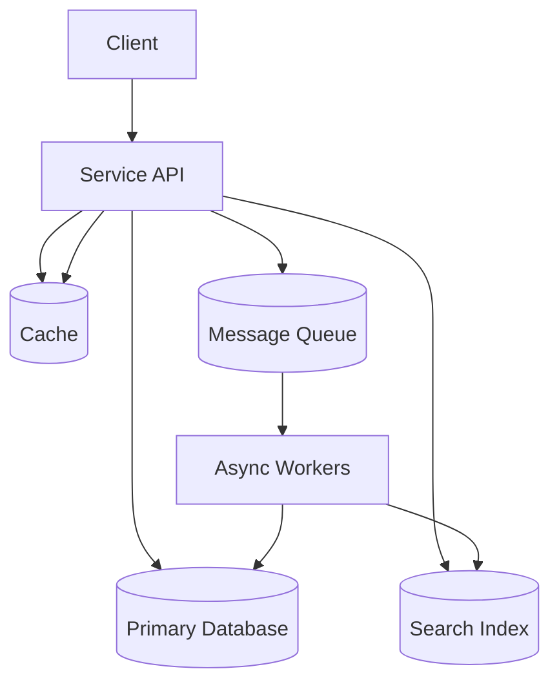

**Tail latency amplification via fanout**
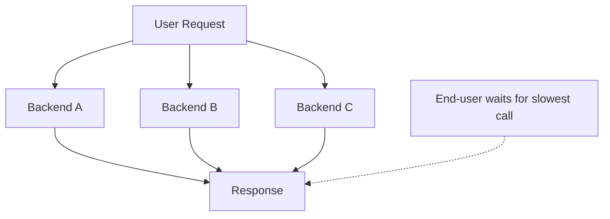

**Scale up vs scale out (stateful component)**
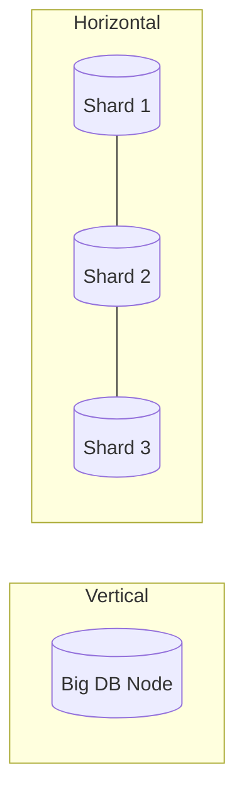

**Rolling upgrade with redundancy**
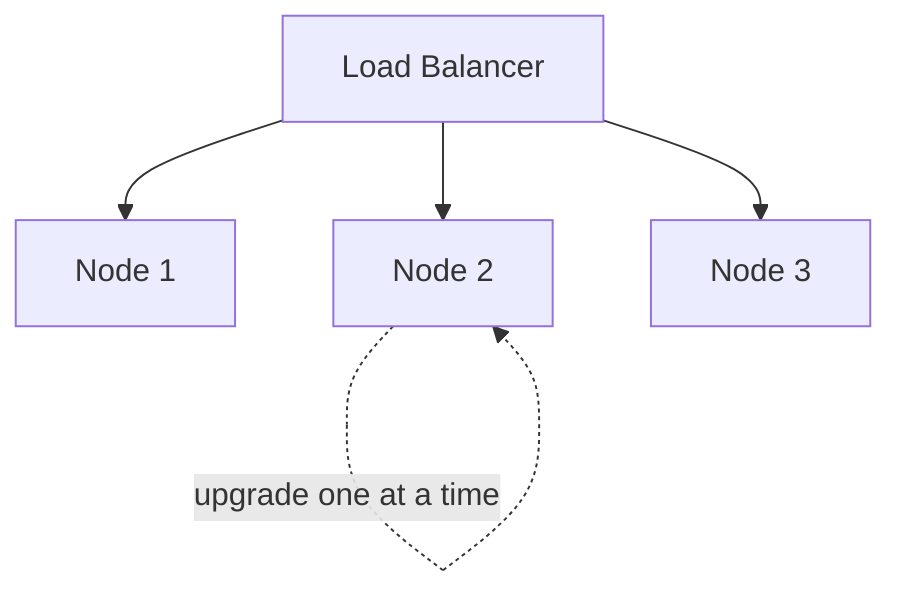

## 5. Real-World War Stories

- **[Netflix Chaos Monkey]** — Chose fault injection to make failures routine and recovery paths real. Solves: “we never tested this failover path.” Breaks when: teams treat it as a stunt instead of pairing it with observability and safe rollback.
- **[Amazon tail latency culture]** — Optimized for high percentiles (p99.9) because the slowest customers are often the most valuable and fanout amplifies tails. Solves: user experience and revenue sensitivity to latency. Breaks when: teams chase extreme percentiles without controlling variance sources (GC, I/O, noisy neighbors).
- **[Twitter timeline fanout]** — Moved work from read-time to write-time to match read-heavy load; later used a hybrid for celebrities. Solves: read scaling. Breaks when: fanout for “heavy hitters” creates hotspots and unpredictable write load.

## 6. Senior Engineer Thinking Patterns

- **Questions to ask in design reviews**
  1. What are the explicit **SLOs** (p95/p99 latency, availability) and what trade-offs are we making to hit them?
  2. What are the **load parameters** and how can each one grow (QPS, fanout, data size, skew)?
  3. What are the top failure modes (hardware, software, human), and what’s the **recovery path** for each?
  4. What’s the operational model: deploys, rollbacks, migrations, on-call playbooks, and observability?
  5. What are we doing today that will make change hard in 12 months (tight coupling, hidden state)?

- **Red flags to watch for**
  - “Average latency is fine.”
  - “We’ll shard later” (with no plan for how).
  - “Ops will handle it” (translation: nobody owns operability).
  - “It’s just a cache/index/queue” (translation: critical dependency hiding in plain sight).

- **The thing junior engineers get wrong**
  - They optimize the wrong metric (mean latency) and ignore the system’s real constraints: tail latency, operational toil, and correctness under failure.

## 7. Connections Map
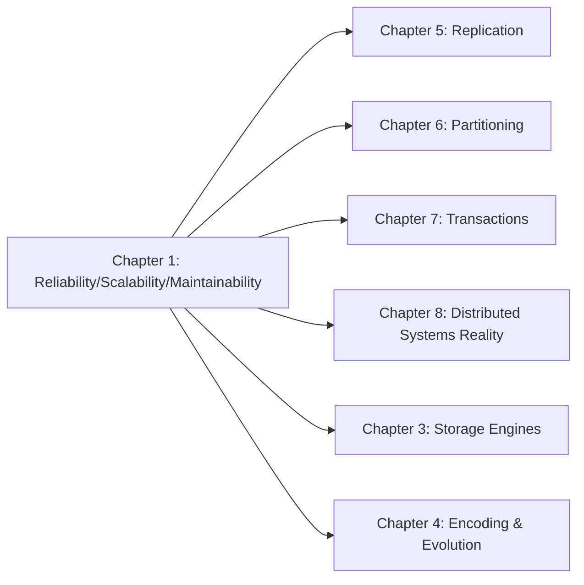

## 8. Flashcard Questions (12)

**Q:** What’s the difference between a **fault** and a **failure**?  
**A:** A fault is a component deviation; a failure is the user-visible service not meeting its promise.

**Q:** Why are **percentiles** more useful than averages for latency?  
**A:** Averages hide outliers; percentiles capture the user pain in the tail.

**Q:** What causes **tail latency amplification**?  
**A:** Fanout: one user request depends on many backend calls and waits for the slowest.

**Q:** When is it worth scaling **vertically** instead of sharding?  
**A:** When state still fits and simplicity/operability matter more than theoretical headroom.

**Q:** Why do **systematic software faults** tend to be worse than hardware faults?  
**A:** They’re correlated across nodes and can take down the whole fleet simultaneously.

**Q:** What’s a senior way to reduce the blast radius of human error?  
**A:** Guardrails + staged rollouts + fast rollback + safe sandboxes + good observability.

**Q:** What’s the core idea behind **fault tolerance**?  
**A:** Assume faults happen and design so the system still meets its contract.

**Q:** What makes autoscaling risky?  
**A:** Bad signals and feedback loops can scale you into an outage (or a giant bill).

**Q:** Why is “magic scaling sauce” a myth?  
**A:** Scalability is workload-specific; you scale by matching architecture to load parameters.

**Q:** What’s the fastest way to destroy maintainability?  
**A:** Hidden coupling and accidental complexity that nobody can reason about.

**Q:** What’s the difference between **latency** and **response time**?  
**A:** Response time includes service + queueing + network; latency often refers to waiting/queueing.

**Q:** How should you treat operations and on-call in system design?  
**A:** As first-class requirements; people are part of the system.

## 9. System Design Interview Angle

- **Interview questions this chapter helps answer**
  - “Design a scalable web service with strict latency SLOs.”
  - “Design a feed/timeline system and explain scaling trade-offs.”
  - “Design for reliability under failures.”

- **Senior-signal vocabulary**
  - **SLO/SLA**, **p95/p99**, **tail latency**, **load parameters**, **fanout**, **fault vs failure**, **rolling deploy**, **operability**, **accidental complexity**.

- **Mini worked example: ‘Design a notifications service’**
  - Start with SLOs: delivery latency target + acceptable loss/duplication semantics.
  - Identify load parameters: events/sec, fanout per event, peak bursts, skew.
  - Decide scale strategy: vertical first, then partition by user; measure p99 and backpressure.
  - Reliability plan: retries with idempotency, queue-based buffering, staged rollout, dashboards that show lag and drop rate.


# Chapter 2 — Data Models and Query Languages

## 1. TL;DR (3–5 sentences)
This chapter is about choosing a **data model** that matches how your application’s data is shaped and queried, because the model determines what’s easy, what’s painful, and what will fail at scale. In production you’ll decide whether to pay for **joins and normalization** (relational), embrace **document locality and schema flexibility** (document), or model deep relationships explicitly (graph). You’ll also choose between **declarative** and **imperative** query styles; declarative wins most of the time because it enables optimization and parallelism. The senior move: pick a model based on *relationships + access patterns + evolution*, not hype.

## 2. Core Concepts

- **Data models are layers of abstraction** — Applications model the world with domain objects; databases provide a general-purpose model (tables/docs/graphs); storage engines turn that into bytes. Each layer constrains the next.  
  - **Why it matters** — If the database model fights your domain model, you get endless impedance-mismatch glue code and slow iteration.  
  - **Mental model** — Each layer is a **translation**; too many translations means lost meaning and bugs.

- **Relational model (tables + joins)** — Data as rows in tables with relationships expressed via keys and resolved with **joins**. Great for many-to-many relationships and flexible querying.  
  - **Why it matters** — If you need ad-hoc queries, reporting, and complex relationships, relational avoids data duplication and keeps invariants enforceable.  
  - **Mental model** — Relational is a **spreadsheet with superpowers** and a query planner.

- **Document model (nested JSON-like docs)** — Data as self-contained documents with nested structures; great for one-to-many “tree” shapes and locality when you fetch the whole document.  
  - **Why it matters** — If your reads usually need the full object graph (profile + positions + contact info), documents avoid multi-table joins and simplify code.  
  - **Mental model** — Document DB is a **folder per entity**: everything about the entity in one file.

- **Many-to-one and many-to-many relationships** — IDs reduce duplication, but require joins/lookups to resolve references. Documents handle trees well; many-to-many pushes you back toward joins or denormalization.  
  - **Why it matters** — Teams pick document stores and later add features (recommendations, org pages) that introduce many-to-many links—and suddenly the model is awkward and slow.  
  - **Mental model** — Trees are easy; graphs sneak in as your product grows.

- **Normalization vs denormalization** — **Normalization** reduces duplication and update anomalies; **denormalization** copies data to speed reads but requires keeping copies consistent.  
  - **Why it matters** — Denormalization without a consistency strategy becomes silent data corruption (“some copies updated, others not”).  
  - **Mental model** — Normalization is “one source of truth”; denormalization is “cached copies everywhere.”

- **Schema-on-write vs schema-on-read** — Relational is typically **schema-on-write** (DB enforces structure). Many document systems are **schema-on-read** (structure enforced by application).  
  - **Why it matters** — Schema-on-read enables fast iteration for heterogeneous data, but pushes validation to runtime and increases “surprise null” bugs.  
  - **Mental model** — Schema-on-write is a **compiler**; schema-on-read is **dynamic typing**.

- **Locality** — Documents are stored contiguously, so fetching the whole doc is efficient; but updating often rewrites the whole doc. Relational can also achieve locality with clustering/interleaving features.  
  - **Why it matters** — If you frequently read small slices of large documents, you waste I/O and memory.  
  - **Mental model** — Locality is “one disk seek instead of many,” until updates turn into “rewrite the book.”

- **Declarative query languages** — You specify *what* you want (SQL), not *how* to get it. Enables query optimizers, indexing improvements, and parallel execution.  
  - **Why it matters** — Imperative query code bakes in access paths and prevents the database from optimizing as data grows.  
  - **Mental model** — Declarative is “describe the destination,” not “list every turn.”

- **MapReduce as a query style** — A “code in the middle” model: map emits key/value pairs; reduce aggregates. Powerful, but often harder than writing a single declarative query.  
  - **Why it matters** — Teams overuse MapReduce-like UDFs and kill optimization; then they reinvent a declarative pipeline later.  
  - **Mental model** — MapReduce is writing your own query plan by hand.

- **Graph data models** — Vertices + edges. Natural for highly connected data (social graphs, recommendations, routing) and for queries that traverse relationships.  
  - **Why it matters** — For deep traversals, relational joins get complex and slow; graph models make the traversal the primitive.  
  - **Mental model** — Graph DB is “follow edges like hyperlinks.”

## 3. Key Trade-offs & Decision Framework

| Option A | Option B | When to choose A | When to choose B |
|---|---|---|---|
| **Relational (tables + joins)** | **Document (nested docs)** | Many-to-many relationships, ad-hoc queries, strong constraints, analytics/reporting | Document-shaped entities, mostly one-to-many trees, “fetch whole object” reads |
| **Normalize** | **Denormalize** | You need correctness, easy updates, multiple consumers, clear ownership | You need read performance and can enforce sync via pipelines, triggers, or rebuildable projections |
| **Schema-on-write** | **Schema-on-read** | You want enforced invariants, safer changes, and predictable fields | Data is heterogeneous, evolving rapidly, or shaped by external producers |
| **Declarative queries** | **Imperative access paths / hand-coded joins** | Almost always: portability, optimization, parallelization | Only when you’re implementing a specialized engine or the optimizer can’t express what you need |
| **Graph model** | **Relational model** | Deep traversals and relationship-centric queries are first-class | Relationships exist but traversals are shallow and set-based queries dominate |

**Non-obvious gotchas (the “6 months later” pain)**
- Document DBs feel great until you need joins. Then you either build an app-side join (slow) or denormalize (consistency pain).
- Schemaless doesn’t mean schema-free; it means “schema moved into application code,” often without tooling.
- Declarative queries keep paying dividends because the engine can improve without rewriting the app.

## 4. Architecture Diagrams

**Data model layering**
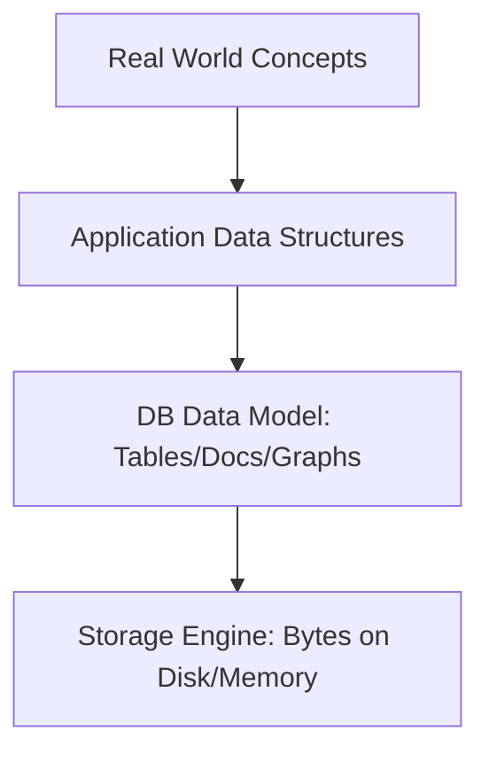

**Relational vs document representation (entity with subrecords)**
```mermaid
graph LR
    subgraph Relational
      U[users row] --> P[positions table]
      U --> E[education table]
      U --> C[contact_info table]
    end
    subgraph Document
      D[User Document] --> DP[positions[]]
      D --> DE[education[]]
      D --> DC[contact_info{}]
    end
```

**Many-to-many relationships pushing toward joins/graph**
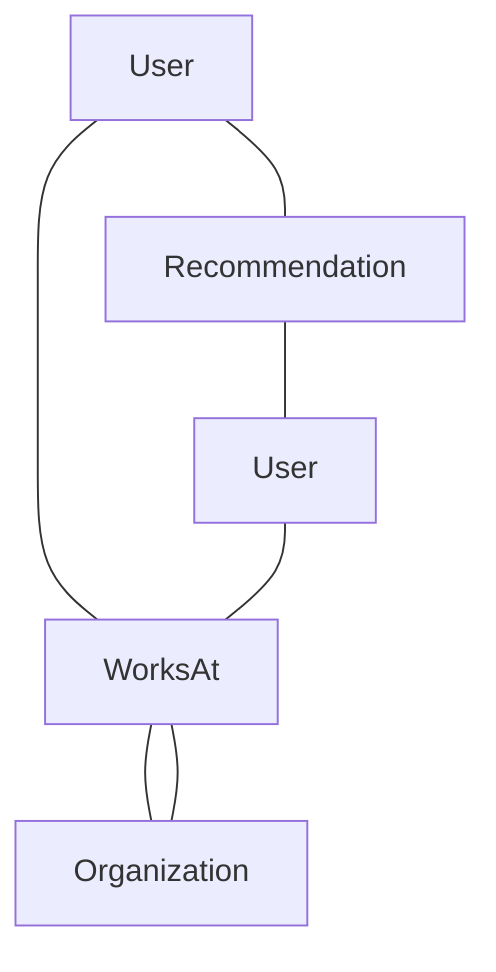

## 5. Real-World War Stories

- **[PostgreSQL (JSONB + SQL)]** — Chose a hybrid: relational core with document support, enabling both joins and document-like payloads. Solves: incremental migration and flexible fields. Breaks when: teams store “everything in JSONB” and lose constraints, indexes, and query clarity.
- **[MongoDB]** — Chose document-centric storage with flexible schema and locality. Solves: rapid iteration and document-shaped reads. Breaks when: many-to-many features arrive and teams either duplicate data or bolt on app-side joins.
- **[Neo4j]** — Chose graph primitives for relationship traversal. Solves: deep traversal queries that are awkward in SQL. Breaks when: workloads are actually set-based aggregations where column stores/SQL engines dominate.

## 6. Senior Engineer Thinking Patterns

- **Questions to ask in design reviews**
  1. What are the dominant **relationships** (one-to-many tree vs many-to-many graph)?
  2. What are the dominant **access patterns** (fetch whole entity vs slice + aggregate vs traversal)?
  3. What invariants must be enforced (uniqueness, referential integrity), and where will enforcement live?
  4. How will the schema evolve? Do we need schema-on-write safety or schema-on-read flexibility?
  5. If we denormalize, what’s the **single source of truth** and the **rebuild strategy**?

- **Red flags to watch for**
  - “We won’t need joins.”
  - “Schemaless means we don’t need migrations.”
  - “We’ll just store blobs of JSON forever.”
  - “We can maintain duplicates manually.”

- **The thing junior engineers get wrong**
  - They choose a database based on vibe (“NoSQL is web scale”) instead of modeling relationships and queries.

## 7. Connections Map
```mermaid
graph LR
    Ch2[Chapter 2: Data Models] --> Ch3[Chapter 3: Storage Engines]
    Ch2 --> Ch4[Chapter 4: Encoding & Evolution]
    Ch2 --> Ch6[Chapter 6: Partitioning & Indexes]
    Ch2 --> Ch10[Chapter 10: Batch (joins at scale)]
    Ch5[Chapter 5: Replication] --> Ch2
```

## 8. Flashcard Questions (12)

**Q:** When is a **document model** a clear win?  
**A:** When your entities are naturally tree-shaped and you usually fetch the whole entity at once.

**Q:** What feature creep tends to break document-only designs?  
**A:** Many-to-many relationships and cross-entity queries.

**Q:** Why does **normalization** help correctness?  
**A:** It reduces duplication so updates happen in one place, preventing inconsistent copies.

**Q:** When is **denormalization** worth it?  
**A:** When read performance matters and you have an explicit strategy to keep copies consistent (pipelines, rebuildable projections).

**Q:** What’s the real meaning of “schemaless”?  
**A:** The schema is implicit and enforced by applications at read time, not by the database.

**Q:** Why do declarative languages enable better performance over time?  
**A:** Optimizers and indexes can improve without rewriting queries.

**Q:** What’s the main drawback of app-side joins in document DBs?  
**A:** More network round trips, higher latency, and more coupling in application code.

**Q:** When is a **graph model** the most natural?  
**A:** When traversals across relationships are core (friends-of-friends, pathfinding, recommendations).

**Q:** Why can large documents be a performance trap?  
**A:** Reading small fields forces loading the whole doc; updates often rewrite the entire doc.

**Q:** What does “polyglot persistence” imply architecturally?  
**A:** You’ll integrate multiple datastores; correctness shifts to dataflow and contracts.

**Q:** What’s the key advantage of IDs for references?  
**A:** They avoid duplicating human-meaningful strings and make updates centralized.

**Q:** Why is MapReduce often replaced by higher-level query languages?  
**A:** Writing coordinated map/reduce code is harder and blocks optimizer improvements.

## 9. System Design Interview Angle

- **Interview questions this chapter helps answer**
  - “Design a user profile store.”
  - “Design a social network graph / recommendations.”
  - “Choose a database for an events pipeline.”

- **Senior-signal vocabulary**
  - **Normalization/denormalization**, **schema-on-write/read**, **locality**, **many-to-many**, **declarative queries**, **query optimizer**, **polyglot persistence**.

- **Mini worked example: ‘Design LinkedIn-like profiles’**
  - If the profile is mostly loaded as a whole: document model can be clean.
  - If you need org pages, recommendations, and cross-profile queries: relational or graph becomes more compelling.
  - Senior answer: choose a system of record, then derive read-optimized views (search index, denormalized profile cache) via dataflow.


# Chapter 3 — Storage and Retrieval

## 1. TL;DR (3–5 sentences)
This chapter is about what your database is *actually doing* when you read and write: storage engines are trade-offs between **write throughput**, **read latency**, and **space amplification**. In production you’ll choose between **log-structured** designs (LSM trees) and **page-oriented** designs (B-trees), and you’ll pay their hidden costs: compaction spikes, write amplification, fragmentation, and cache behavior. You’ll also decide whether you’re optimizing for **OLTP** (many small reads/writes) or **OLAP** (scans + aggregates), because the right storage layout is different. Senior engineers can explain these mechanics and predict failure modes before they happen.

## 2. Core Concepts

- **Storage engine goals** — Persist data, retrieve efficiently, support indexes, handle crashes, and manage concurrency—under a workload shape.  
  - **Why it matters** — You can’t debug p99 latency if you don’t know whether you’re bottlenecked on disk seeks, compaction, or cache misses.  
  - **Mental model** — Storage engines are **machines for turning writes into future reads**.

- **Append-only log** — Many systems first write to a log for durability, then build indexes/structures for reads.  
  - **Why it matters** — Without a write-ahead log, crashes can corrupt state or lose acknowledged writes.  
  - **Mental model** — The log is the **black box recorder**.

- **Hash indexes** — Key → byte offset mapping; fast point lookups, weak for range queries. Often paired with append-only logs.  
  - **Why it matters** — Hash indexes melt down if you need ordered scans, prefix queries, or “all keys between A and B.”  
  - **Mental model** — Hash index is a **phone book** for exact names only.

- **SSTables and LSM-trees** — Write to an in-memory structure (memtable), flush sorted immutable files (**SSTables**), then periodically **compact**/merge them. Great write throughput; reads may touch multiple files.  
  - **Why it matters** — Compaction is where your p99 goes to die if you don’t size resources and tune it.  
  - **Mental model** — LSM is **write now, organize later**—like stuffing papers into trays, then filing them in batches.

- **Compaction** — Merging sorted files to discard overwritten/deleted data and keep read amplification bounded.  
  - **Why it matters** — Poor compaction strategy causes runaway disk usage, write stalls, and tail latency spikes.  
  - **Mental model** — Compaction is **garbage collection for storage**.

- **B-trees** — Keep data sorted in pages; updates rewrite pages in place (with WAL). Great for range scans and predictable reads; writes cause random I/O and fragmentation.  
  - **Why it matters** — B-trees can be very stable for mixed workloads, but random writes and page splits can limit throughput on write-heavy workloads.  
  - **Mental model** — B-tree is a **well-organized filing cabinet** where inserts sometimes force you to reshuffle drawers.

- **Write amplification vs read amplification** — LSM reduces random writes but may rewrite data during compaction; B-trees rewrite pages and update multiple structures. Reads may amplify when you touch many files/pages.  
  - **Why it matters** — “High write throughput” claims are meaningless if write amplification destroys SSD endurance or compaction stalls.  
  - **Mental model** — Amplification is “how many extra miles you drive to deliver one package.”

- **Secondary indexes and multi-dimensional queries** — Indexes accelerate reads but add write cost. Multi-dimensional queries (geo, time) need specialized indexes.  
  - **Why it matters** — Teams add indexes until writes crawl, then discover they built an accidental analytics DB on OLTP storage.  
  - **Mental model** — Indexes are **shortcuts** you must maintain whenever roads change.

- **OLTP vs OLAP** — **Transaction processing (OLTP)** is lots of small reads/writes; **analytics (OLAP)** is big scans + aggregates. One engine rarely excels at both without specialized storage (columnar, separate warehouses).  
  - **Why it matters** — Running analytics on OLTP storage causes contention and unpredictable latency for user traffic.  
  - **Mental model** — OLTP is a **cash register**; OLAP is an **audit and reporting department**.

- **Data warehousing** — Copy operational data into a warehouse optimized for analytics. Enables heavy queries without hurting OLTP.  
  - **Why it matters** — Without an analytics separation, product teams eventually DDoS your primary DB with dashboards.  
  - **Mental model** — Warehouse is a **read replica optimized for questions**, not transactions.

- **Star vs snowflake schemas** — Modeling analytics: fact tables for events + dimension tables for attributes; star is denormalized around the fact.  
  - **Why it matters** — Bad warehouse schemas lead to slow joins and unreadable queries, killing adoption.  
  - **Mental model** — Facts are **what happened**; dimensions are **context**.

- **Column-oriented storage** — Store by column, not row; great for scans, compression, and vectorized execution. Weak for point lookups and frequent updates.  
  - **Why it matters** — Column stores make aggregates fast and cheap; row stores make transactional point reads fast. Mixing them naively disappoints.  
  - **Mental model** — Row store is “all fields for one customer together”; column store is “all customers’ ages together.”

- **Compression and sort order** — Column stores compress well; sorting by common filters boosts compression and query speed.  
  - **Why it matters** — The wrong sort key turns columnar scans into wasted I/O and higher costs.  
  - **Mental model** — Sorting is **pre-grouping** your data so queries walk less.

- **Materialized views / data cubes** — Precompute aggregates to make reads fast; pay with write/update complexity and staleness.  
  - **Why it matters** — “We’ll compute on the fly” becomes “the dashboard takes 3 minutes,” then everyone builds inconsistent caches.  
  - **Mental model** — Materialized views are **pre-cooked meals**.

## 3. Key Trade-offs & Decision Framework

| Option A | Option B | When to choose A | When to choose B |
|---|---|---|---|
| **LSM-tree (log-structured)** | **B-tree (page-oriented)** | Write-heavy workloads, sequential I/O, high ingestion; tolerate compaction complexity | Read-heavy/mixed workloads with range queries and stable latency; mature operational patterns |
| **Hash index** | **Tree/ordered index** | Exact-key lookups dominate; no range scans | Range queries, prefix scans, ordered iteration |
| **Row-oriented (OLTP)** | **Column-oriented (OLAP)** | Lots of point reads/writes; transactional consistency; frequent updates | Scan+aggregate heavy; high compression; analytics queries |
| **Compute aggregates at read time** | **Materialize aggregates** | Low query volume or fast compute; freshness is critical | High query volume; repeatable queries; you can accept staleness and rebuild complexity |
| **Single mixed-use DB** | **Separate warehouse** | Small scale, simple needs, limited analytics | Serious analytics usage; protect OLTP from heavy scans; cost predictability |

**Non-obvious gotchas (the “6 months later” pain)**
- LSM compaction competes with foreground writes and can cause “write stalls” and p99 spikes.
- B-tree performance can degrade with fragmentation and random I/O; you need vacuum/defrag and sane fill factors.
- Indexes are not free: every “quick query” index adds write cost and storage overhead.

## 4. Architecture Diagrams

**LSM-tree write/read path**
```mermaid
graph TD
    W[Write] --> WAL[WAL / Commit Log]
    W --> Mem[Memtable (in-memory)]
    Mem -->|flush| SST1[SSTable (sorted, immutable)]
    SST1 --> Comp[Compaction/Merge]
    Comp --> SST2[SSTables (leveled/compacted)]
    R[Read] --> Mem
    R --> BF[Bloom Filters]
    R --> SST2
```

**B-tree page structure (conceptual)**
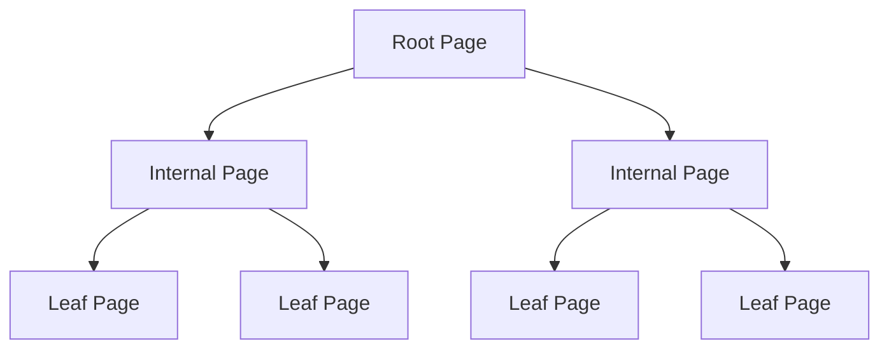

**OLTP vs OLAP separation**
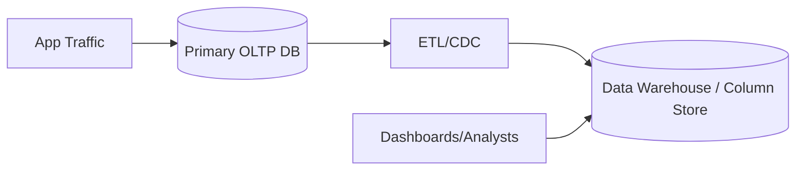

**Materialized view pipeline**
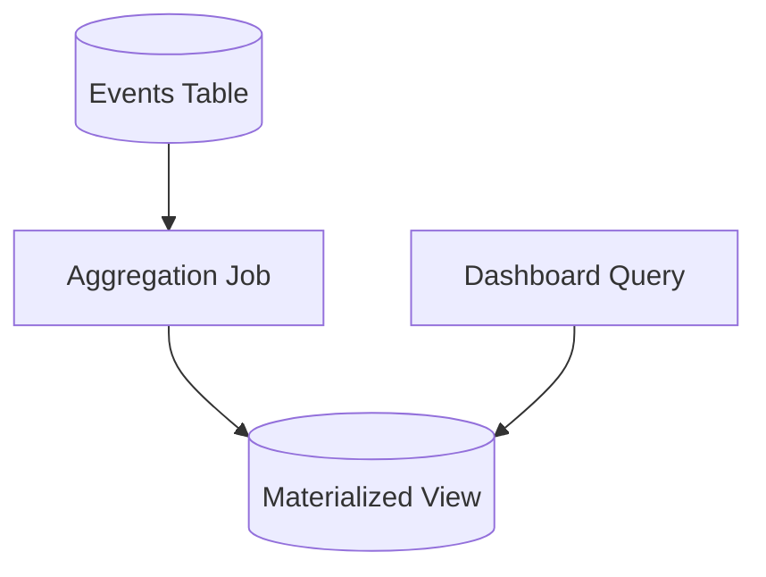

## 5. Real-World War Stories

- **[RocksDB / LevelDB]** — LSM-tree design optimized for write-heavy workloads and predictable disk usage with compaction. Solves: high ingest on SSDs. Breaks when: compaction debt accumulates (slow disks, wrong settings) and foreground writes stall.
- **[InnoDB (MySQL)]** — B-tree indexes with WAL and buffer pool; strong for OLTP and range scans. Solves: mixed read/write transactional workloads. Breaks when: buffer pool is undersized, random I/O dominates, or long transactions block purge.
- **[Parquet/ORC + Presto/Spark]** — Columnar files + scan engines; strong compression and predicate pushdown. Solves: cheap analytics at scale. Breaks when: data isn’t partitioned/sorted well and every query becomes a full scan.

## 6. Senior Engineer Thinking Patterns

- **Questions to ask in design reviews**
  1. What’s the workload: point lookups, range scans, writes/sec, write size, read/write ratio?
  2. What are the latency SLOs—especially p99—and what background work competes with foreground (compaction, GC, vacuum)?
  3. What’s the expected data growth and how does it affect amplification and storage costs?
  4. Are we mixing OLTP and OLAP in one system? If yes, what isolation exists?
  5. What are the operational knobs and failure modes (disk full, compaction debt, corruption recovery)?

- **Red flags to watch for**
  - “We’ll just add indexes until queries are fast.”
  - “Compaction is automatic; we don’t need to think about it.”
  - “We can run analytics directly on the primary DB.”
  - “We need both point reads and huge scans on the same store with no trade-offs.”

- **The thing junior engineers get wrong**
  - They treat “database performance” as a black box and don’t connect symptoms (p99 spikes) to mechanisms (compaction, cache misses, random I/O).

## 7. Connections Map
```mermaid
graph LR
    Ch3[Chapter 3: Storage & Retrieval] --> Ch5[Chapter 5: Replication (logs/WAL)]
    Ch3 --> Ch6[Chapter 6: Partitioning (indexes per partition)]
    Ch3 --> Ch10[Chapter 10: Batch/Scan workloads]
    Ch2[Chapter 2: Data Models] --> Ch3
    Ch4[Chapter 4: Encoding] --> Ch3
```

## 8. Flashcard Questions (12)

**Q:** Why do LSM-trees have great write throughput?  
**A:** They turn random writes into sequential appends and batch organization via compaction.

**Q:** What’s **compaction debt**?  
**A:** When background compaction can’t keep up, causing more files, worse reads, and eventual write stalls.

**Q:** When do B-trees shine?  
**A:** Range queries and predictable read latency in mixed workloads.

**Q:** What is **write amplification** and why should you care?  
**A:** Extra bytes written per logical write; it impacts throughput, cost, and SSD wear.

**Q:** Why are hash indexes poor for range queries?  
**A:** Hashing destroys order; you can’t scan “between A and B” efficiently.

**Q:** Why separate OLTP and OLAP?  
**A:** Analytics scans contend with transactional workloads and cause unpredictable latency.

**Q:** Why do column stores compress better?  
**A:** Similar values cluster in columns, enabling efficient encoding and fewer bytes read.

**Q:** What’s a star schema’s key idea?  
**A:** Facts in a central table with denormalized dimensions for fast analytic queries.

**Q:** What’s the trade-off of materialized views?  
**A:** Fast reads vs complexity/staleness and rebuild/update cost.

**Q:** What’s the role of a WAL?  
**A:** Durability and crash recovery by recording changes before applying them to main structures.

**Q:** Why can LSM reads be slower than B-tree reads?  
**A:** Reads may consult multiple SSTables/levels unless compaction and filters keep it bounded.

**Q:** What’s the operational risk of “lots of indexes”?  
**A:** Writes slow down, storage grows, and maintenance tasks increase.

## 9. System Design Interview Angle

- **Interview questions this chapter helps answer**
  - “Design a key-value store.”
  - “Pick a database/storage engine for write-heavy events.”
  - “Design an analytics warehouse.”

- **Senior-signal vocabulary**
  - **LSM tree**, **SSTable**, **compaction**, **write/read amplification**, **B-tree**, **columnar storage**, **OLTP vs OLAP**, **materialized view**.

- **Mini worked example: ‘Choose storage for click events’**
  - Write-heavy ingest → LSM-backed store or log + columnar lakehouse.
  - Queries: if mostly aggregates over time → columnar + partitioning by date.
  - Senior answer: separate system of record (append-only log) from derived serving (indexes/aggregates) and plan compaction/retention.


# Chapter 4 — Encoding and Evolution

## 1. TL;DR (3–5 sentences)
This chapter is about **data as a contract over time**: how you encode it, how you evolve it, and how you avoid breaking running systems during deploys. In production you’ll choose between human-readable formats (JSON/XML) and schema-based binary formats (Avro/Protobuf/Thrift), and you’ll live with the consequences in performance, compatibility, and tooling. The senior decision is not “which serializer is best,” but “what compatibility guarantees do we need between producers and consumers across versions?” You’ll also pick a **dataflow** style (DB replication, REST/RPC, or messaging) and design evolution strategies that avoid coordinated deploys.

## 2. Core Concepts

- **Encoding/serialization** — Turning in-memory objects into bytes for storage or the network, and back again.  
  - **Why it matters** — In distributed systems, incompatible encodings are outages: consumers crash, pipelines stall, data becomes unreadable.  
  - **Mental model** — Encoding is your system’s **wire protocol** and **time capsule**.

- **Language-specific formats** — Native serialization (Java, Python, etc.) is convenient but often unsafe (security) and locks you to one language/runtime.  
  - **Why it matters** — Cross-language systems and long-lived storage make language-specific encodings a trap.  
  - **Mental model** — It’s like storing your data as “whatever this version of the VM feels like.”

- **Text formats (JSON/XML/CSV)** — Human-readable and ubiquitous, but ambiguous types, larger payloads, and limited schema enforcement.  
  - **Why it matters** — “Everything is a string” bugs, precision loss, and payload bloat show up at scale.  
  - **Mental model** — Text formats are **easy to eyeball**, hard to guarantee.

- **Binary formats** — More compact and faster to parse; usually need schemas or at least type metadata.  
  - **Why it matters** — Binary saves cost and latency for high-volume systems, but requires discipline around schema evolution.  
  - **Mental model** — Binary is **shipping containers**: efficient, but you need manifests.

- **Schemas as contracts** — A schema documents fields and types and enables validation and evolution. The key is compatibility: **backward** (new code reads old data) and **forward** (old code reads new data).  
  - **Why it matters** — Without a compatibility plan, deploys become “everyone must upgrade together,” which is how large orgs get stuck.  
  - **Mental model** — Schema evolution is **API versioning for data**.

- **Protocol Buffers / Thrift** — Schema-based formats with code generation and field tags. Great for RPC and storage with strict contracts.  
  - **Why it matters** — Tags/field numbers make evolution possible, but misuse (renumbering, changing types) causes silent corruption.  
  - **Mental model** — Field tags are “stable IDs” for meaning.

- **Avro** — Schema-based format often used in data pipelines; schema can be stored with data or separately. Strong story for evolution in streaming/batch ecosystems.  
  - **Why it matters** — Avro + schema registry enables independent producer/consumer evolution at scale.  
  - **Mental model** — Avro is “data travels with a schema handshake.”

- **Modes of dataflow**
  - **Through databases** — One process writes, another reads later; schema changes require safe migrations.  
  - **Through services (REST/RPC)** — Clients and servers evolve independently; compatibility is API design.  
  - **Message-passing** — Producers emit events; consumers process asynchronously; evolution requires event schema discipline.  
  - **Why it matters** — Each mode has different coupling and failure modes; you need evolution strategies that match the coupling.  
  - **Mental model** — DB is “shared memory over time,” RPC is “conversation,” messaging is “mailbox.”

- **Rolling upgrades and compatibility** — Real systems deploy gradually; old and new versions coexist. Your encoding/API must support mixed-version operation.  
  - **Why it matters** — “We’ll deploy everything at once” is a fantasy; mixed-version is the default state.  
  - **Mental model** — Deploys are a **wave**, not a switch.

## 3. Key Trade-offs & Decision Framework

| Option A | Option B | When to choose A | When to choose B |
|---|---|---|---|
| **JSON/XML** | **Binary (Avro/Protobuf/Thrift)** | Low volume, debugging friendliness, external/public APIs, loose typing acceptable | High volume, strict contracts, performance-sensitive pipelines, long-term storage with tooling |
| **Schema-on-write** | **Schema-on-read** | You need validation and enforced invariants; fewer runtime surprises | Heterogeneous data sources; rapid iteration; you can tolerate runtime checks |
| **REST (HTTP + JSON)** | **RPC (gRPC/Thrift/Protobuf)** | Public-facing APIs, broad compatibility, caching, human inspectability | Internal service-to-service, strict contracts, streaming, performance |
| **Database as integration point** | **Event/message log integration** | Simple systems, low coupling needs, centralized ownership | Decoupled architectures, multiple consumers, replay/backfill needs |
| **Coordinated deploy** | **Backward/forward compatibility** | Only in tiny systems; otherwise it’s a scaling bottleneck | Default: mixed versions; independent deploys across teams |

**Non-obvious gotchas (the “6 months later” pain)**
- Breaking changes are often accidental: reusing field numbers, changing semantics, “optional” fields becoming required.
- Text formats hide type bugs until data hits a corner case (nulls, large ints, timezone, float precision).
- Schema registries and compatibility checks are not “nice to have” once you have many producers/consumers—they’re how you avoid pipeline-wide outages.

## 4. Architecture Diagrams

**Schema evolution with mixed versions**
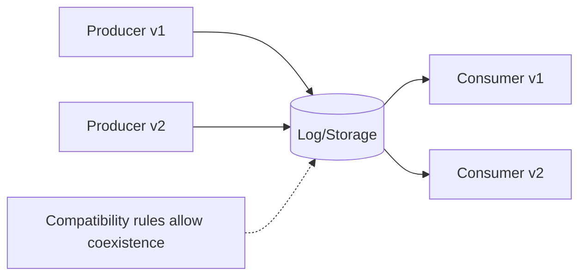

**Dataflow through a database**
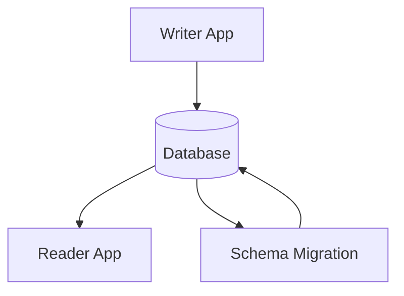

**Dataflow through services (RPC/REST)**
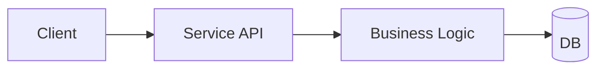

**Message-passing dataflow**
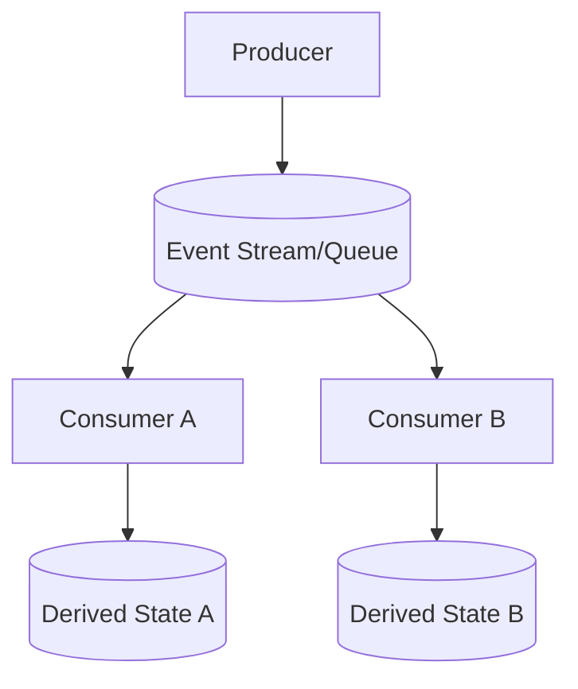

## 5. Real-World War Stories

- **[Kafka + Schema Registry (Avro/Protobuf)]** — Chose explicit schemas with compatibility checks to allow many producers/consumers to evolve independently. Solves: safe evolution at scale. Breaks when: teams bypass registry, change semantics without versioning, or fail to handle unknown fields.
- **[gRPC (Protobuf)]** — Chose binary schemas and codegen for internal APIs. Solves: performance and strict contracts. Breaks when: field numbers/types are changed incorrectly or teams assume “optional” fields are always present.
- **[REST + JSON]** — Chose human-readable payloads for public APIs. Solves: broad interoperability. Breaks when: clients are pinned to old behavior and the server makes “minor” changes that are actually breaking.

## 6. Senior Engineer Thinking Patterns

- **Questions to ask in design reviews**
  1. What are the backward/forward compatibility guarantees for this data/API?
  2. How do we handle unknown fields, missing fields, and default values?
  3. What’s the rollout plan (mixed versions, partial deploys, rollback)?
  4. Who owns the schema and how are changes reviewed and tested?
  5. How will we support replay/backfill when decoding rules change?

- **Red flags to watch for**
  - “We can just change the field name/type.”
  - “All clients will upgrade quickly.”
  - “No need for schema registry; we’ll coordinate.”
  - “We’ll validate in the consumer” (with many consumers = chaos).

- **The thing junior engineers get wrong**
  - They treat serialization as a library choice instead of a long-term contract and an operational constraint.

## 7. Connections Map
```mermaid
graph LR
    Ch4[Chapter 4: Encoding & Evolution] --> Ch5[Chapter 5: Replication (log formats)]
    Ch4 --> Ch10[Chapter 10: Batch (file formats)]
    Ch4 --> Ch11[Chapter 11: Stream (event schemas)]
    Ch2[Chapter 2: Data Models] --> Ch4
    Ch1[Chapter 1: Maintainability] --> Ch4
```

## 8. Flashcard Questions (12)

**Q:** What’s the core risk of changing a data format in production?  
**A:** Old and new versions will coexist; incompatibility causes outages or silent corruption.

**Q:** Backward vs forward compatibility—what’s the difference?  
**A:** Backward: new reader reads old data; forward: old reader reads new data.

**Q:** When is JSON a bad idea?  
**A:** High-volume internal pipelines where performance and strict typing matter.

**Q:** Why do schema-based formats scale better organizationally?  
**A:** They enable tooling (compat checks, codegen, validation) and reduce coordination.

**Q:** What’s the classic failure mode of Protobuf/Thrift evolution?  
**A:** Reusing field numbers or changing field meaning/type incorrectly.

**Q:** Why is “coordinated deploy” a smell?  
**A:** It doesn’t scale with teams/systems; mixed-version operation is the reality.

**Q:** What’s the trade-off of binary formats?  
**A:** Efficiency vs the need for schema discipline and tooling.

**Q:** How do message-based systems complicate evolution?  
**A:** Many independent consumers rely on the event schema; breaking changes ripple widely.

**Q:** Why is language-native serialization risky?  
**A:** Security vulnerabilities and tight coupling to a runtime/language.

**Q:** What’s a practical strategy for safe schema evolution?  
**A:** Add fields as optional, keep old fields for a deprecation window, and validate compatibility in CI.

**Q:** What’s “schema-on-read” good for?  
**A:** Heterogeneous data and rapid iteration, at the cost of runtime validation.

**Q:** What must you design for in any deploy strategy?  
**A:** Rollbacks and mixed versions—always.

## 9. System Design Interview Angle

- **Interview questions this chapter helps answer**
  - “Design an event bus with schema evolution.”
  - “Design a versioned API for mobile clients.”
  - “Design CDC/events between services.”

- **Senior-signal vocabulary**
  - **Backward/forward compatibility**, **schema registry**, **rolling upgrade**, **wire contract**, **idempotent consumers**, **unknown fields**, **API evolution**.

- **Mini worked example: ‘Design an order-created event’**
  - Choose a schema-based event (Avro/Protobuf) with explicit versioning.
  - Additive changes only (new optional fields); never change semantics silently.
  - Enforce compatibility checks in CI and registry; consumers must ignore unknown fields.
  - Plan deprecation: keep old fields until all consumers are migrated, then remove with a major version bump.


---

# Chapter 5 — Replication

## 1. TL;DR (3–5 sentences)
Replication is how you get **availability**, **read scaling**, and **geo-latency wins**—and how you accidentally buy **inconsistency** and **weird failure modes**. In production, you’ll repeatedly decide: “Do we accept **replication lag** and stale reads, or do we force reads to the leader and pay latency?” and “Do we want a single write leader, multiple leaders, or no leaders at all?” The chapter’s punchline: replication is easy when nothing fails; it’s the *failures + concurrency + lag* that decide whether your system is sane. If you can’t clearly state your consistency guarantees under failover, you don’t have guarantees—you have hope.

## 2. Core Concepts

- **Leader–follower replication** — One node is the **leader** (accepts writes). Others are **followers** (copy leader’s changes and serve reads). The leader defines a total order of writes; followers apply them in that order.  
  - **Why it matters** — If you promote a stale follower during failover without understanding what it has (or hasn’t) replicated, you can lose acknowledged writes or resurrect deleted data.  
  - **Mental model** — Leader is the “source of truth ledger”; followers are “photocopies that are always catching up.”

- **Synchronous vs asynchronous replication** — **Synchronous** means the leader waits for replicas before acknowledging success; **asynchronous** means the leader acknowledges first and replicas catch up later.  
  - **Why it matters** — Synchronous replication can turn a single slow replica or a WAN hiccup into a full write outage. Asynchronous replication can acknowledge writes that vanish after leader loss.  
  - **Mental model** — Sync is “I won’t say ‘done’ until everyone saw it.” Async is “I’ll tell you it’s done and mail copies later.”

- **Replication log** — The mechanism for shipping changes: often a **write-ahead log (WAL)**, a logical change stream, or statement-based replication. What you replicate (bytes vs logical operations) affects correctness and flexibility.  
  - **Why it matters** — Replicating statements can be nondeterministic (e.g., `NOW()`, random functions, different execution plans). Replicating physical pages can be fast but brittle across versions. Logical replication is flexible but more complex.  
  - **Mental model** — You can replicate “what I typed” (statements), “what got recorded” (logical events), or “the final printed page” (physical).

- **Failover** — Detect leader failure, promote a follower, and reconfigure clients. The hard part is **failure detection** and avoiding **split brain** (two leaders).  
  - **Why it matters** — A flaky network can make both sides think the other is dead. If both accept writes, you’ve created two diverging histories you may not be able to reconcile.  
  - **Mental model** — Failover is a baton pass in a relay race—except the track is foggy and both runners might grab a baton.

- **Replication lag** — Followers are behind the leader due to network delay, load, or batching. Lag breaks assumptions that “read-after-write” is automatic.  
  - **Why it matters** — Users write data then immediately read stale state (“I saved but it disappeared”). Analytics jobs read inconsistent snapshots. Pagination shows duplicate/missing items.  
  - **Mental model** — Your follower is a news website: it publishes yesterday’s edition until the truck arrives.

- **Session guarantees** — Client-visible consistency patterns that make systems feel sane even with lag:  
  - **Read-your-writes** (after you write, you must see it)  
  - **Monotonic reads** (you shouldn’t go backward in time)  
  - **Consistent prefix reads** (no seeing replies before the original post)  
  - **Why it matters** — Without these, your product feels broken even if the database is “eventually consistent.”  
  - **Mental model** — These are “no gaslighting” rules for users.

- **Multi-leader replication** — Multiple leaders accept writes and replicate to each other. Used for multi-region active/active, offline-first, or collaborative systems.  
  - **Why it matters** — You’ve accepted **write conflicts** as a normal state. If you don’t design conflict resolution explicitly, you’ll resolve conflicts by “last write wins” and silently lose data.  
  - **Mental model** — Two editors changing the same doc at once. If you don’t define merge rules, you’ll randomly drop paragraphs.

- **Leaderless replication** — No single leader. Clients (or a coordinator) write to multiple replicas. Reads consult multiple replicas and reconcile. Common pattern: **quorums** with parameters **N/R/W**.  
  - **Why it matters** — Leaderless systems trade simpler failover for harder semantics: concurrency is normal, stale replicas exist, and “quorum” does *not* automatically mean “linearizable.”  
  - **Mental model** — Instead of one boss, you poll a committee and go with the majority.

- **Quorums, sloppy quorums, hinted handoff** — **Quorum** writes to W of N nodes and reads from R of N. **Sloppy quorum** relaxes “which N” during outages; **hinted handoff** stores temporary hints to repair later.  
  - **Why it matters** — Sloppy quorums improve availability but can break assumptions about which replicas have the latest data, increasing inconsistency windows and complicating recovery.  
  - **Mental model** — Sloppy quorum is “we’ll accept signatures from nearby offices during a local outage and reconcile later.”

- **Detecting concurrent writes** — Use **version vectors** / **vector clocks** (or similar) to detect concurrency so the system can merge or surface conflicts instead of overwriting.  
  - **Why it matters** — Without concurrency detection, you lose writes invisibly. Users will blame you (correctly).  
  - **Mental model** — Each writer keeps a “receipt stamp.” If two receipts don’t contain each other’s stamp, they happened concurrently.

## 3. Key Trade-offs & Decision Framework

| Option A | Option B | When to choose A | When to choose B |
|---|---|---|---|
| **Leader–follower** | **Leaderless** | You want simpler semantics, easier “read-your-writes,” and strong-ish ordering | You want high availability for writes under node loss and are willing to handle conflicts |
| **Asynchronous replication** | **Synchronous replication** | You can tolerate losing recent acknowledged writes in rare leader-loss events; you need low-latency writes | You cannot lose acknowledged writes and can tolerate higher write latency or occasional write unavailability |
| **Read from followers** | **Read from leader** | You need read scaling and can tolerate staleness; you can add session guarantees | You need freshness/consistency (payments, inventory, auth state) and can pay for it |
| **Multi-leader** | **Single leader** | Multi-region active/active, offline clients, collaborative editing where conflicts are expected | Most OLTP systems where you want one global write order and fewer conflicts |
| **Last-write-wins (LWW)** | **Merge/CRDT/app-level resolution** | Only if losing updates is acceptable (often it isn’t) or data is naturally commutative | When correctness matters; when conflicts are real business events |
| **Strict quorums (fixed replica set)** | **Sloppy quorums + hinted handoff** | When you want clearer semantics and easier reasoning | When availability is king and you accept messier consistency + repair |

**Gotchas that bite 6 months later**
- “Quorum” is not a magic spell. Under partitions, clock skew, sloppy quorums, and inconsistent membership, you can still read stale data.
- Failover scripts that “usually work” will eventually create split brain unless leadership is strongly coordinated.
- Adding read replicas without session semantics will produce user-visible inconsistency bugs that look like “frontend issues” but aren’t.

## 4. Architecture Diagrams

**Leader–follower replication + read scaling**
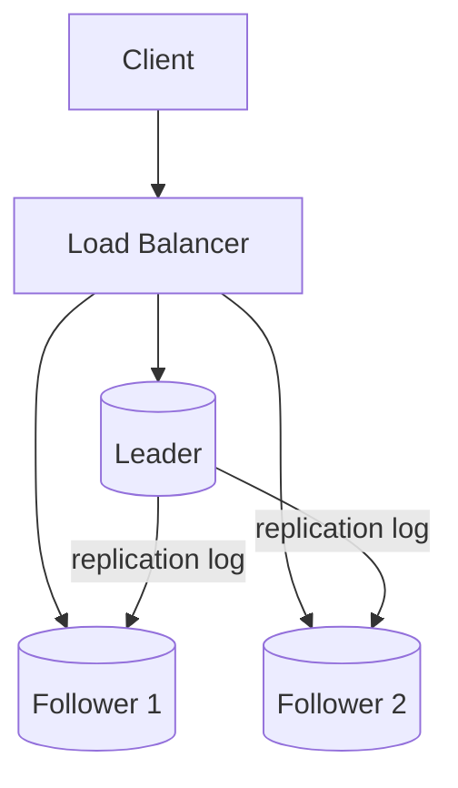

**Failover (and where split brain happens)**
```mermaid
graph TD
    Leader[(Leader)] --> F1[(Follower)]
    Leader --> F2[(Follower)]
    Monitor[Failure Detector] --> Promote[Promote F1]
    Promote --> F1
    Client -->|writes| Leader
    Client -->|writes after failover| F1
    Net[Network Partition] -.->|can cause both to accept writes| Split[Split Brain Risk]
```

**Multi-leader with conflicts**
```mermaid
graph TD
    A[(Leader DC A)] <--> |replicate| B[(Leader DC B)]
    ClientA -->|write X| A
    ClientB -->|write Y| B
    A --> Conflict[Conflict on same key]
    B --> Conflict
    Conflict --> Resolve[Resolve: merge/LWW/manual]
```

**Leaderless quorum read/write + repair**
```mermaid
graph TD
    Client --> Coord[Client/Coordinator]
    Coord --> N1[(Replica 1)]
    Coord --> N2[(Replica 2)]
    Coord --> N3[(Replica 3)]
    Coord -->|W acks| Ack[Write OK]
    Client -->|read| Coord
    Coord -->|read R nodes| N1
    Coord --> N2
    Coord --> Reconcile[Reconcile versions]
    Reconcile --> Repair[Read repair / anti-entropy]
```

## 5. Real-World War Stories

- **PostgreSQL Streaming Replication / MySQL Replication** — Classic leader–follower with replicas for read scaling. Great until: a) you route “must-be-fresh” reads to replicas and ship a consistency bug, or b) your failover promotes a lagging replica and you lose acknowledged writes (async).
- **Cassandra / Dynamo-style systems** — Leaderless with quorums. Great for: high availability and partition tolerance. Breaks when: you assume quorum implies strong consistency, ignore conflict resolution, or let repair/anti-entropy lag until inconsistencies become permanent.
- **CouchDB / multi-master sync** — Multi-leader optimized for offline-first and sync. Great until: conflict volume grows and you realize “conflict resolution” is an application feature you never built.

## 6. Senior Engineer Thinking Patterns

- **Questions to ask in design reviews**
  1. What are the **consistency guarantees** *during* replication lag and *during* failover?
  2. Which reads are allowed to be stale, and how do we enforce that routing?
  3. If two writes race, do we **detect conflicts** or silently overwrite?
  4. What’s our plan for **split brain**—how do we ensure a single leader?
  5. What’s the operational story for repair: backlog, tooling, monitoring, and “time to converge”?

- **Red flags to watch for**
  - “Reads can go to any replica; it’s fine.”
  - “We’ll just do last-write-wins.”
  - “Failover is automatic so we don’t need to test it.”
  - “Quorums guarantee correctness.”

- **The thing junior engineers get wrong**
  - They treat replication as a checkbox (“we have replicas”) instead of a user-visible semantics decision (“what do users observe under lag/failure?”).

## 7. Connections Map
```mermaid
graph LR
    Ch5[Chapter 5: Replication] --> Ch6[Chapter 6: Partitioning]
    Ch5 --> Ch7[Chapter 7: Transactions]
    Ch5 --> Ch8[Chapter 8: Distributed Systems Failures]
    Ch5 --> Ch9[Chapter 9: Consistency & Consensus]
    Ch4[Chapter 4: Encoding/Evolution] --> Ch5
```

## 8. Flashcard Questions (10–15)

**Q:** When is **asynchronous replication** unacceptable?  
**A:** When “acknowledged writes must not be lost,” especially for money movement, security state, or legal records.

**Q:** What’s the most common user-visible bug from read replicas?  
**A:** Broken **read-your-writes** due to **replication lag**.

**Q:** Why is **multi-leader** hard?  
**A:** Conflicts are normal; you must define resolution semantics or lose updates.

**Q:** Does **R + W > N** guarantee strong consistency?  
**A:** No. It helps, but membership changes, sloppy quorums, concurrent writes, and lag can still produce anomalies.

**Q:** What’s **split brain** and why is it catastrophic?  
**A:** Two leaders accept writes → divergent histories → painful reconciliation and possible data loss.

**Q:** When do you route reads to the **leader** even if you have replicas?  
**A:** When the read is correctness-critical or must reflect recent writes (session state, auth, inventory).

**Q:** What’s the difference between **detecting** conflicts and **resolving** conflicts?  
**A:** Detection tells you “these writes are concurrent”; resolution decides what value wins or how to merge.

**Q:** Why is **LWW** often a bad default?  
**A:** It silently drops legitimate updates; it’s “data loss with a smile.”

**Q:** What’s **hinted handoff** good for, and what’s the cost?  
**A:** Higher write availability during node outages; cost is more inconsistency risk and repair complexity.

**Q:** What operational metric matters most for replica health?  
**A:** Lag/backlog + time-to-catch-up (and repair backlog for leaderless systems).

## 9. System Design Interview Angle

- **Interview questions this chapter helps answer**
  - Design a geo-replicated database
  - Design read scaling for a high-QPS service
  - Design multi-region active/active writes
  - Design an “eventually consistent” profile store

- **Senior-signal vocabulary**
  - **replication lag**, **failover**, **split brain**, **read-your-writes**, **monotonic reads**, **quorums (N/R/W)**, **conflict resolution**, **vector clocks**.

- **Mini worked example: “Design a user settings service”**
  - Default: leader–follower, async replication, reads from followers.
  - Add session guarantee: pin a user to leader or track “last seen LSN” and route reads until replicas catch up.
  - For multi-region writes: only if business demands it; otherwise pick one write region and replicate outward.

---

# Chapter 6 — Partitioning

## 1. TL;DR (3–5 sentences)
Partitioning (sharding) is how you scale data beyond one node, but it’s also how you invent **hotspots**, **scatter/gather queries**, and painful **rebalancing** events. The core production decision is: “Do we partition by **key range** (great for range queries) or by **hash** (great for uniform load)?” and then “How do we route requests and move partitions without downtime?” If you don’t design for skew (hot keys, celebrity users), your cluster will be “distributed” but still bottleneck on one partition. Partitioning and secondary indexes is where many systems go from “works in staging” to “on-call nightmare.”

## 2. Core Concepts

- **Partitioning** — Splitting a large dataset into smaller subsets (**partitions/shards**) stored on different nodes. Usually combined with replication.  
  - **Why it matters** — Without partitioning, you hit CPU/RAM/disk limits. With sloppy partitioning, you create hotspots and latency explosions.  
  - **Mental model** — It’s moving from one warehouse to many warehouses: faster overall, but now you need logistics.

- **Partitioning by key range** — Each partition stores a contiguous range of keys (e.g., A–F, G–M). Great for range scans and ordered queries.  
  - **Why it matters** — Time-based keys can hotspot (all new writes go to the “latest” range). Rebalancing ranges can be operationally heavy.  
  - **Mental model** — A library organized alphabetically: browsing is easy; new popular authors can overcrowd one section.

- **Partitioning by hash of key** — Hash the key and assign by hash range. Spreads load more evenly; range queries become scatter/gather.  
  - **Why it matters** — You lose locality. Anything like “give me last 24 hours” becomes expensive unless you add a sort key or secondary structure.  
  - **Mental model** — You threw books into bins by a hash of the title: evenly distributed, but browsing is gone.

- **Skew and hotspots** — Real workloads are skewed: a few keys get most traffic. You must plan for it (key design, salting, splitting, caching).  
  - **Why it matters** — One hot shard can dominate p99 for the whole system, even if the cluster is mostly idle.  
  - **Mental model** — One overloaded checkout lane slows the entire store because everyone queues behind it.

- **Partitioning secondary indexes**
  - **Local (per-partition) index** — Each partition indexes only its own data. Querying by secondary attribute requires hitting all partitions.
  - **Global (term-based) index** — Index partitioned by the indexed term; queries are efficient, but writes become multi-partition and rebalancing gets harder.  
  - **Why it matters** — “We need search by email” can turn into “we just introduced distributed transactions (or inconsistency) by accident.”  
  - **Mental model** — Local index is “each warehouse has its own catalog.” Global index is “a central catalog that points to all warehouses.”

- **Rebalancing** — Moving partitions between nodes as the cluster grows/shrinks or load changes. Done via partition splitting/merging or reassignment.  
  - **Why it matters** — Rebalancing is a top-tier cause of incidents: thundering herds, cache churn, overloaded disks, cascading timeouts.  
  - **Mental model** — You’re moving houses while still living in them.

- **Request routing** — How a client finds the right partition: client-side routing, a routing tier (proxy), or node-to-node forwarding.  
  - **Why it matters** — Wrong routing becomes cross-node hops, higher tail latency, and more failure modes.  
  - **Mental model** — GPS vs asking a concierge vs wandering until you find the right building.

## 3. Key Trade-offs & Decision Framework

| Option A | Option B | When to choose A | When to choose B |
|---|---|---|---|
| **Key range partitioning** | **Hash partitioning** | You need efficient range scans, ordered queries, time-series locality | You need uniform distribution and mostly point lookups |
| **Local secondary indexes** | **Global secondary indexes** | You can tolerate scatter/gather reads or your queries are mostly by primary key | Secondary-attribute queries are core and must be fast |
| **Client-side routing** | **Routing proxy / service** | You control clients and want fewer hops | You want centralized routing, easier reconfig, and simpler clients |
| **Manual rebalancing** | **Automatic rebalancing** | You need predictability and controlled risk | You need elasticity and can invest in safety rails/guardrails |
| **Many small partitions** | **Few large partitions** | You want smooth rebalancing and parallelism | You want lower metadata/overhead and simpler ops |

**Gotchas**
- Hash partitioning doesn’t prevent hotspots if the *key choice* is bad (e.g., everyone writes to the same key).
- Global secondary indexes often imply distributed coordination; if you pretend they don’t, you’ll ship subtle correctness bugs.
- Rebalancing competes with live traffic. If you don’t rate-limit it, it becomes self-inflicted DDoS.

## 4. Architecture Diagrams

**Partitioned + replicated cluster with routing tier**
```mermaid
graph TD
    Client --> Router[Routing Tier]
    Router --> P1[(Partition 1 Replicas)]
    Router --> P2[(Partition 2 Replicas)]
    Router --> P3[(Partition 3 Replicas)]
```

**Key range vs hash (conceptual)**
```mermaid
graph TD
    Keys[Key Space] --> Range[Range partitions: A-F, G-M, N-Z]
    Keys --> Hash[Hash partitions: h(k) in buckets]
```

**Secondary index: local vs global**
```mermaid
graph TD
    Q[Query: email=foo@x] --> Local[Local index: hit all partitions]
    Local --> P1[(P1 local idx)]
    Local --> P2[(P2 local idx)]
    Local --> P3[(P3 local idx)]
    Q --> Global[Global index: route by term]
    Global --> GI[(Index partition: term bucket)]
    GI --> Data[(Primary partitions)]
```

**Rebalancing flow (moving a partition)**
```mermaid
graph TD
    Source[(Node A: Partition X)] -->|copy data| Target[(Node B)]
    Target --> Catchup[Catch up with writes]
    Catchup --> Switch[Switch routing]
    Switch --> Cleanup[Remove old copy]
```

## 5. Real-World War Stories

- **Cassandra / DynamoDB-style hashing** — Hash partitioning to spread load. Wins: predictable distribution for key-value access. Breaks when: you introduce “query by attribute” or “latest data” queries and realize your access pattern fights the partitioning.
- **HBase / Bigtable tablets** — Range partitioning (tablets) optimized for locality and scans. Wins: efficient range queries. Breaks when: sequential keys hotspot (common with timestamps) unless you design row keys carefully.
- **Elasticsearch shards** — Partitioning for search indexes. Wins: parallel query execution. Breaks when: shard sizing is wrong (too many tiny shards = overhead; too few huge shards = painful rebalancing and slow recovery).

## 6. Senior Engineer Thinking Patterns

- **Questions to ask in design reviews**
  1. What’s the **partition key**, and what’s the expected skew (p50 vs p99 key popularity)?
  2. Which queries require **range scans** or **secondary lookups**, and what do they cost under this partitioning?
  3. How do we do **rebalancing** safely (rate limits, backpressure, observability)?
  4. What happens when a partition gets hot—do we split, cache, or redesign keys?
  5. How does routing behave under failures—do we add extra hops or fail fast?

- **Red flags**
  - “We’ll shard by user_id; that always works.”
  - “We can add secondary indexes later.”
  - “Rebalancing is automatic so it’s not an ops concern.”
  - “Scatter/gather is fine; we’ll just add more nodes.”

- **The thing junior engineers get wrong**
  - They optimize for even distribution and forget query patterns, then get killed by scatter/gather and secondary-index reality.

## 7. Connections Map
```mermaid
graph LR
    Ch6[Chapter 6: Partitioning] --> Ch5[Chapter 5: Replication]
    Ch6 --> Ch7[Chapter 7: Transactions]
    Ch6 --> Ch8[Chapter 8: Failure Modes]
    Ch6 --> Ch9[Chapter 9: Ordering/Consensus]
    Ch3[Chapter 3: Storage/Indexes] --> Ch6
    Ch2[Chapter 2: Data Models] --> Ch6
```

## 8. Flashcard Questions (10–15)

**Q:** When is **range partitioning** the right call?  
**A:** When range scans/ordered queries are core and you can manage hotspot risk.

**Q:** When is **hash partitioning** the right call?  
**A:** When point lookups dominate and you want even distribution.

**Q:** What’s the classic failure of time-based primary keys under range partitioning?  
**A:** Hotspotting on the “latest” partition.

**Q:** Why are **global secondary indexes** dangerous?  
**A:** They often imply cross-partition coordination for writes and complex rebalancing.

**Q:** What’s the hidden cost of **local secondary indexes**?  
**A:** Scatter/gather queries that amplify tail latency and failure probability.

**Q:** What’s the safest operational default for rebalancing?  
**A:** Rate-limit and make it observable; treat it like production traffic.

**Q:** How do you reduce hotspotting without changing semantics?  
**A:** Key salting, composite keys, splitting hot partitions, caching hot reads.

**Q:** Why do “more partitions” help rebalancing?  
**A:** Smaller units move faster and enable smoother load distribution.

**Q:** What’s a common routing architecture smell?  
**A:** Requests bounce between nodes (forwarding chains) before hitting the right shard.

**Q:** What’s the partitioning question you must answer before choosing a database?  
**A:** “What is my access pattern and partition key, and how does it behave under skew?”

## 9. System Design Interview Angle

- **Interview questions this chapter helps answer**
  - Design a URL shortener (partition by short code)
  - Design a chat/messaging store (room/user partitioning)
  - Design a time-series system (time + tenant partitioning)
  - Design a distributed cache/database sharding strategy

- **Senior-signal vocabulary**
  - **hotspot**, **skew**, **scatter/gather**, **rebalancing**, **routing tier**, **local vs global secondary index**.

- **Mini worked example: “Design a time-series metrics DB”**
  - If you range-partition by timestamp, you hotspot. Fix with (tenant_id, time_bucket, random_salt) keying.
  - Use hash partitioning for write distribution, plus a sort key for time scans.
  - Plan rebalancing: many small partitions, throttle movement, and preserve query SLA.

---

# Chapter 7 — Transactions

## 1. TL;DR (3–5 sentences)
Transactions are your tool for keeping **invariants** true under concurrency and failure, but they cost performance and availability—especially in distributed setups. The key production decision is: “Which invariants must *never* break?” and then “What isolation level is strong enough to protect them without killing throughput?” Weak isolation produces bugs that look impossible (“we checked the constraint, how did it break?”). The chapter is a guided tour of isolation anomalies and why **serializability** is the only isolation level that makes concurrency behave like a single-threaded program.

## 2. Core Concepts

- **Transaction** — A group of reads/writes that the database treats as one unit for correctness under concurrency and crashes. Transactions are an abstraction to simplify reasoning—when they actually provide the guarantees you think they do.  
  - **Why it matters** — Without transactions (or equivalent correctness design), you’ll ship race-condition data corruption that only appears under load.  
  - **Mental model** — Transactions are “airlocks”: either the whole batch passes safely, or nothing does.

- **ACID (and the slippery “C”)** — **Atomicity**, **Consistency**, **Isolation**, **Durability**. The important senior point: “Consistency” is not magic database fairy dust; it’s “your application invariants remain true.”  
  - **Why it matters** — Teams assume “ACID means my business rules are enforced.” No—*you* must encode invariants with constraints/transactions.  
  - **Mental model** — ACID is a set of safety rails; it doesn’t choose your destination.

- **Isolation and anomalies** — Isolation is about what concurrent transactions can observe. Weak isolation allows anomalies like **dirty reads**, **non-repeatable reads**, **read skew**, **lost updates**, **write skew**, and **phantoms**.  
  - **Why it matters** — These anomalies create heisenbugs: QA can’t reproduce them; production hits them daily.  
  - **Mental model** — Isolation determines whether you’re living in one consistent “timeline” or watching multiple timelines interleave.

- **Read Committed** — Common default. Prevents dirty reads and dirty writes, but still allows non-repeatable reads and phantoms.  
  - **Why it matters** — It’s fine for many CRUD apps, but it will not protect multi-step invariants.  
  - **Mental model** — You only see “committed reality,” but reality can change between blinks.

- **Snapshot Isolation / Repeatable Read (MVCC)** — Reads see a consistent snapshot; writers don’t block readers. Great for read-heavy workloads and avoiding read skew.  
  - **Why it matters** — Prevents some painful anomalies, but **does not prevent write skew**. People assume it’s “basically serializable.” It isn’t.  
  - **Mental model** — You’re reading a photo of the database at a moment in time while updates continue elsewhere.

- **Lost updates** — Two writers read the same value and both write back updates, losing one. Fix with atomic operations, locks, compare-and-set, or serializable isolation.  
  - **Why it matters** — Classic “counter went down,” “inventory oversold,” “settings reverted” incidents.  
  - **Mental model** — Two people editing the same spreadsheet cell; last save silently overwrites.

- **Write skew and phantoms** — Multi-row constraints break under snapshot isolation: each transaction checks a condition, both pass, and together they violate the invariant (e.g., “at least one doctor on call”).  
  - **Why it matters** — This is the #1 “but we checked!” incident class.  
  - **Mental model** — Two bouncers each see “someone is inside” and both step out.

- **Serializability** — The gold standard: outcome equals some serial (one-at-a-time) order. Implementations include:
  - **Actual serial execution** (single-threaded)
  - **Two-Phase Locking (2PL)** (pessimistic)
  - **Serializable Snapshot Isolation (SSI)** (optimistic detection of dangerous patterns)  
  - **Why it matters** — If the invariant matters, you want serializability or explicit app-level compensation logic.  
  - **Mental model** — “Make concurrency look like single-threaded code.”

## 3. Key Trade-offs & Decision Framework

| Option A | Option B | When to choose A | When to choose B |
|---|---|---|---|
| **Use transactions for invariants** | **Avoid transactions + compensate** | When correctness > throughput and invariants are strict | When operations are naturally idempotent/commutative or you can tolerate temporary inconsistency |
| **Read Committed** | **Snapshot Isolation** | Simple CRUD; fewer long-lived read transactions | Read-heavy; need consistent reads without blocking writers |
| **Snapshot Isolation** | **Serializable** | When you can tolerate some anomalies or design around them | When invariants must hold under concurrency (money, quotas, uniqueness-with-logic) |
| **2PL (pessimistic)** | **SSI (optimistic)** | High contention data where blocking is acceptable and aborts are costly | Medium contention where aborts are cheaper than lock contention |
| **Atomic single-row ops** | **Multi-row transactional logic** | Counters, flags, per-key updates | Cross-row invariants, multi-entity updates |

**Gotchas**
- Snapshot isolation prevents read skew but still allows write skew—this surprises teams constantly.
- Serializable doesn’t mean “slow” by default; it means “you must handle retries/aborts” (especially under optimistic schemes).
- “We’ll just do it in application code” often becomes distributed transactions… badly.

## 4. Architecture Diagrams

**MVCC snapshot reads (conceptual)**
```mermaid
graph TD
    Tx1[Tx1 reads snapshot @ t0] --> V1[(Row versions <= t0)]
    Tx2[Tx2 writes new version @ t1] --> V2[(New row version)]
    Tx1 -->|still sees| V1
```

**Lost update**
```mermaid
graph TD
    A[TxA reads x=10] --> A2[TxA writes x=11]
    B[TxB reads x=10] --> B2[TxB writes x=9]
    A2 --> Final[(Final x=?)]
    B2 --> Final
```

**Write skew (two transactions violate an invariant together)**
```mermaid
graph TD
    Inv[Invariant: at least 1 doctor on-call] --> T1[Tx1 checks: 2 on-call]
    Inv --> T2[Tx2 checks: 2 on-call]
    T1 --> U1[Tx1 turns off Doctor A]
    T2 --> U2[Tx2 turns off Doctor B]
    U1 --> Bad[(Now 0 on-call)]
    U2 --> Bad
```

**Serializable implementation choices**
```mermaid
graph TD
    Need[Need serializable] --> S1[Single-thread execution]
    Need --> S2[2PL locking]
    Need --> S3[SSI detect + abort]
```

## 5. Real-World War Stories

- **PostgreSQL** — MVCC for performance; offers serializable via **SSI** (practical serializability without always locking readers). Solves: many read-heavy OLTP workloads. Breaks when: apps don’t handle serialization failures with retries.
- **MySQL InnoDB** — Strong MVCC + locking semantics; commonly uses REPEATABLE READ plus gap/next-key locks for phantom prevention in some cases. Solves: robust OLTP. Breaks when: unexpected lock contention/deadlocks appear under new query patterns.
- **Spanner / FoundationDB** — Aim for strong transactional semantics at scale (different mechanisms, but same goal: correctness with distribution). Solves: developers can reason clearly. Breaks when: you ignore latency costs of cross-region coordination or design transactions that span too much data.

## 6. Senior Engineer Thinking Patterns

- **Questions to ask in design reviews**
  1. What are the **invariants** (must always be true), and where are they enforced?
  2. What isolation level is assumed, and what anomalies are acceptable?
  3. Under contention, do we prefer **blocking** (locks) or **aborts + retries**?
  4. What’s the operational plan for deadlocks/serialization failures (metrics + retries + backoff)?
  5. Are we accidentally creating distributed transactions across services?

- **Red flags**
  - “We use transactions so it’s consistent.” (Define consistent.)
  - “Repeatable read is basically serializable.”
  - “We’ll just check then update.”
  - “If it fails, we’ll rerun it” (with no idempotency design).

- **The thing junior engineers get wrong**
  - They think isolation levels are “performance knobs” instead of “which concurrency bugs you’re willing to ship.”

## 7. Connections Map
```mermaid
graph LR
    Ch7[Chapter 7: Transactions] --> Ch5[Chapter 5: Replication]
    Ch7 --> Ch6[Chapter 6: Partitioning]
    Ch7 --> Ch8[Chapter 8: Distributed Failures]
    Ch7 --> Ch9[Chapter 9: Consensus/Atomic Commit]
    Ch3[Chapter 3: Storage Engines] --> Ch7
```

## 8. Flashcard Questions (10–15)

**Q:** What does the “C” in ACID actually mean in practice?  
**A:** Your application invariants hold—*if you encode/enforce them*.

**Q:** What anomaly does **Read Committed** prevent?  
**A:** Dirty reads and dirty writes (but not write skew/phantoms).

**Q:** What does **snapshot isolation** give you that Read Committed doesn’t?  
**A:** A consistent snapshot across multiple reads (prevents read skew).

**Q:** What’s the canonical bug snapshot isolation still allows?  
**A:** **Write skew**.

**Q:** What’s the simplest fix for **lost updates**?  
**A:** Atomic updates (increment/CAS) or locking/serializable isolation.

**Q:** When is **serializability** non-negotiable?  
**A:** Money movement, quotas, uniqueness with business rules, anything legally or financially sensitive.

**Q:** What’s the downside of **2PL**?  
**A:** Lock contention and deadlocks; tail latency under contention.

**Q:** What’s the downside of **SSI**?  
**A:** More aborts under contention; you must retry safely.

**Q:** Why is “check-then-act” dangerous under weak isolation?  
**A:** The checked condition can change before the act commits.

**Q:** What’s a reliable app pattern when using serializable transactions?  
**A:** Make operations idempotent and retry on serialization failures with backoff.

## 9. System Design Interview Angle

- **Interview questions**
  - Design a banking ledger / payment system
  - Design seat reservation / inventory with concurrency
  - Design rate limiting / quota enforcement
  - Design an order placement flow

- **Senior-signal vocabulary**
  - **invariants**, **isolation anomalies**, **MVCC**, **write skew**, **phantoms**, **serializable**, **2PL**, **retries/idempotency**.

- **Mini worked example: “Design inventory reservation”**
  - Invariant: stock never goes negative.
  - Weak isolation + check-then-decrement will oversell under concurrency.
  - Use: atomic decrement with constraint, or serializable transaction around “check + update.”
  - Add: retry loop on serialization failure; avoid long transactions.

---

# Chapter 8 — The Trouble with Distributed Systems

## 1. TL;DR (3–5 sentences)
Distributed systems fail in ways single-node systems don’t: **partial failures**, **unbounded network delays**, **ambiguous time**, and **process pauses** that look exactly like crashes. In production, your job isn’t to “avoid failure”—it’s to design so you don’t make incorrect decisions based on incomplete information (“the node is dead”). The chapter’s blunt message: you cannot safely assume the network is reliable or the clock is correct, and timeouts are not truth—they’re guesses. If your correctness depends on clocks or perfect failure detection, your system is already broken; you just haven’t hit the right outage yet.

## 2. Core Concepts

- **Partial failure** — In distributed systems, some nodes can fail while others continue. Worse: the failure is often ambiguous (is it down, slow, partitioned, paused?).  
  - **Why it matters** — You can’t “just retry” without creating duplicates, overload, or split brain.  
  - **Mental model** — It’s not a blackout; it’s a city where random neighborhoods lose power independently.

- **Unreliable networks** — Packets can be delayed, dropped, duplicated, or reordered. There is no fixed upper bound on delay in the general case.  
  - **Why it matters** — “It didn’t respond in 2s, so it must be dead” is a guess that can cause incorrect failover and data divergence.  
  - **Mental model** — The network is a postal service, not a telepathic link.

- **Timeouts are heuristics** — A timeout doesn’t tell you what happened; it only tells you you waited long enough. Choosing timeouts is a balancing act: too short → false suspicions; too long → slow recovery.  
  - **Why it matters** — Aggressive timeouts + retries can create **retry storms** that turn a small slowdown into a full outage.  
  - **Mental model** — Knocking on a door: silence might mean “not home” or “in the shower.”

- **Fault detection** — Detecting failures is inherently uncertain. Most systems implement **suspicion** (“probably down”) rather than certainty.  
  - **Why it matters** — Many algorithms require careful separation between “suspect” and “declare dead,” usually tied to quorum/consensus.  
  - **Mental model** — Medicine triage: you act under uncertainty, and wrong calls have consequences.

- **Synchronous vs asynchronous models** — Real systems often behave like asynchronous networks (no guaranteed bounds). Designing as if the world is synchronous is how you ship safety bugs.  
  - **Why it matters** — Algorithms that assume bounded delays can fail catastrophically under GC pauses, overload, or partitions.  
  - **Mental model** — Designing for “sunny day” physics and deploying into “real weather.”

- **Unreliable clocks** — Clocks drift. **Time-of-day clocks** (wall clock) can jump due to NTP adjustments. **Monotonic clocks** only move forward and are safer for measuring durations.  
  - **Why it matters** — Using wall-clock timestamps for ordering or uniqueness causes anomalies: events appear to happen “in the future” or out of order.  
  - **Mental model** — Wall clocks are political; monotonic clocks are physics.

- **Clock synchronization and its limits** — NTP helps but is not perfect; uncertainty remains. You must treat time as an interval, not a point, if correctness depends on it.  
  - **Why it matters** — If you use timestamps to decide “which write wins,” clock skew becomes silent data loss.  
  - **Mental model** — You don’t know the exact time; you know a fuzzy window.

- **Process pauses** — GC, stop-the-world pauses, VM suspension, disk stalls, CPU starvation. A paused process is indistinguishable from a dead process to the rest of the system.  
  - **Why it matters** — Pauses trigger false failovers, membership churn, and leader elections at the worst possible moment.  
  - **Mental model** — Someone falls asleep mid-conversation; everyone assumes they left forever.

- **Knowledge, truth, and majority** — In distributed systems, “truth” is often defined by **quorums/majorities** (because certainty is impossible). This is the foundation for consensus.  
  - **Why it matters** — If you let two disjoint groups both think they’re the cluster, you get split brain.  
  - **Mental model** — Reality is what the majority of witnesses agree on.

- **Byzantine faults** — Nodes can lie or behave maliciously. Most production systems assume crash/omission faults, not Byzantine behavior—unless you’re in adversarial environments.  
  - **Why it matters** — Designing for Byzantine faults is expensive. But ignoring adversaries in the wrong domain (public networks, hostile clients) is negligent.  
  - **Mental model** — Crash faults are “honest failures”; Byzantine faults are “traitors.”

## 3. Key Trade-offs & Decision Framework

| Option A | Option B | When to choose A | When to choose B |
|---|---|---|---|
| **Fast timeouts** | **Slow timeouts** | You need fast failover and can tolerate false positives | You need stability and want fewer unnecessary elections/failovers |
| **Retries everywhere** | **Retries with budgets + backoff** | Basically never | Always: bounded retries, jitter, circuit breakers, and idempotency |
| **Wall-clock timestamps for ordering** | **Logical ordering (sequence IDs / logical clocks)** | Only for display/UX, not correctness | For correctness: replication ordering, conflict resolution, distributed coordination |
| **Assume synchronous behavior** | **Design for asynchrony** | Only in tightly controlled environments with proven bounds | For real production systems with GC, load spikes, and partitions |
| **Crash-fault model** | **Byzantine-fault model** | Most internal datacenter systems | Adversarial environments (public consensus, untrusted nodes) |

**Gotchas**
- A “simple” timeout tweak can destabilize your whole cluster (election storms).
- Pauses + aggressive failure detection create cascading failures.
- If your system uses time-of-day for correctness, you’re one NTP incident away from corruption.

## 4. Architecture Diagrams

**Partial failure + ambiguity**
```mermaid
graph TD
    A[Node A] --> Net[Network]
    Net --> B[Node B]
    Net --> C[Node C]
    Pause[GC pause / overload] -.-> B
    Partition[Network partition] -.-> Net
    A -->|timeout| Suspect[Suspect B failed]
    Suspect --> Action[Failover / reroute]
```

**Retry storm failure scenario**
```mermaid
graph TD
    Client --> Svc[Service]
    Svc --> DB[(Database)]
    DB --> Slow[DB slowdown]
    Slow --> Timeout[Svc timeouts]
    Timeout --> Retry[Client retries]
    Retry --> Overload[More load on DB]
    Overload --> Slow
```

**Clock skew breaks ordering**
```mermaid
graph TD
    W1[Write at Node A time=10:00] --> Store[(Store)]
    W2[Write at Node B time=09:59] --> Store
    Skew[Clock skew] --> Wrong[Wrong "latest write" decision]
```

**Majority defines leadership (conceptual)**
```mermaid
graph TD
    Nodes[Cluster Nodes] --> Vote[Majority vote/quorum]
    Vote --> Leader[Single leader chosen]
    PartitionA[Partition A] -.-> Vote
    PartitionB[Partition B] -.-> Vote
    Vote --> Avoid[Avoid split brain if quorum enforced]
```

## 5. Real-World War Stories

- **NTP / Leap second incidents** — Wall-clock adjustments triggered widespread failures in systems that assumed time never jumps. Fix: use monotonic clocks for durations; treat time sync as uncertain; avoid timestamps for correctness.
- **ZooKeeper/etcd-style coordination under GC pauses** — A long GC pause looks like node death → leadership churn → cascading instability. Fix: tune GC, isolate coordination nodes, use conservative failure detection, and reduce pause risk.
- **Cloud network partitions** — One AZ can’t talk to another; both sides are “up.” If your system doesn’t enforce quorum/majority decisions, you get split brain and divergent writes.

## 6. Senior Engineer Thinking Patterns

- **Questions to ask in design reviews**
  1. What happens under **network partition**—who is allowed to keep writing?
  2. Are timeouts used for **performance** (fine) or for **correctness** (danger)?
  3. Are operations **idempotent**, and do we have retry budgets/backoff/jitter?
  4. Do we use clocks for anything correctness-critical (ordering, uniqueness, leases)?
  5. What’s the plan for long **process pauses** (GC, VM suspension, disk stalls)?

- **Red flags**
  - “The network is reliable in our datacenter.”
  - “If it times out, it failed.”
  - “We use timestamps to resolve conflicts.”
  - “We retry until it works.”
  - “Split brain can’t happen.”

- **The thing junior engineers get wrong**
  - They assume failure is obvious and clocks are accurate, then build logic that makes irreversible decisions based on those assumptions.

## 7. Connections Map
```mermaid
graph LR
    Ch8[Chapter 8: Distributed Systems Reality] --> Ch5[Chapter 5: Replication Failures]
    Ch8 --> Ch6[Chapter 6: Partitioning & Routing]
    Ch8 --> Ch7[Chapter 7: Transaction Semantics at Scale]
    Ch8 --> Ch9[Chapter 9: Consensus/Linearizability]
    Ch1[Chapter 1: Reliability] --> Ch8
```

## 8. Flashcard Questions (10–15)

**Q:** Why are **partial failures** uniquely hard?  
**A:** Because some components work and others don’t, and the system can’t know which with certainty.

**Q:** What does a **timeout** actually tell you?  
**A:** Only that you waited long enough—not whether the request succeeded, failed, or is still in flight.

**Q:** What’s the most dangerous naive response to timeouts?  
**A:** Unbounded retries (retry storms).

**Q:** When should you use **monotonic clocks**?  
**A:** Measuring durations/timeouts/latencies.

**Q:** When is it dangerous to use **wall-clock time**?  
**A:** For ordering, uniqueness, conflict resolution, or correctness-critical decisions.

**Q:** Why can’t failure detection be perfect?  
**A:** Because networks and pauses can delay messages arbitrarily; you can’t distinguish “slow” from “dead” reliably.

**Q:** What’s the operational symptom of aggressive failure detection?  
**A:** Election storms, flapping leaders, cascading retries.

**Q:** Why do distributed systems often define truth by **majority**?  
**A:** Because certainty is impossible; majorities prevent two disjoint groups from both being authoritative.

**Q:** What’s a process pause that commonly fools systems?  
**A:** Stop-the-world GC or VM suspension.

**Q:** When do **Byzantine faults** matter?  
**A:** When nodes/clients are potentially malicious or untrusted, not just crash-failing.

## 9. System Design Interview Angle

- **Interview questions**
  - Design a highly available service across zones/regions
  - Design a cache or DB client retry policy
  - Design leader election and failover strategy
  - Design an idempotent API for payments/orders

- **Senior-signal vocabulary**
  - **partial failure**, **timeouts as heuristics**, **retry budget**, **circuit breaker**, **monotonic clock**, **clock skew**, **split brain**, **quorum/majority**.

- **Mini worked example: “Design an idempotent payments API”**
  - Use idempotency keys so retries don’t double-charge.
  - Treat timeouts as “unknown outcome”; reconcile via read-after or outbox/event log.
  - Use conservative retries with jitter; shed load under saturation.
  - Avoid clock-based ordering for correctness; use sequence IDs / ledger ordering.

---

# Chapter 9 — Consistency and Consensus

## 1. TL;DR (3–5 sentences)
This chapter is about picking **consistency guarantees** that match what your product *must* be correct about, and then paying the real costs (latency, availability, operational complexity) to actually achieve them. In production, you’ll face decisions like “Do we need **linearizable** reads/writes for this state, or is **causal/eventual consistency** fine?” and “Are we building on a **consensus** system (Raft/Paxos/ZooKeeper/etcd), or are we faking it with timeouts and hoping?” The punchline: if you need a single truth under failures, you’re talking about **quorums + consensus + a well-defined ordering**—not “replicas” in the generic sense. If you don’t explicitly define ordering, you *will* get anomalies that look like data corruption even when every node is “healthy.”

## 2. Core Concepts

- **Consistency guarantees** — A **consistency model** is a promise about what clients can observe when reads/writes happen concurrently and failures occur. It’s not a moral statement (“strong is better”), it’s a contract that lets humans reason about behavior.  
  - **Why it matters** — Teams ship “eventually consistent” systems for correctness-critical state (auth, payments) and spend months chasing ghosts: stale reads, out-of-order updates, and “impossible” states.  
  - **Mental model** — Consistency is the rules of time travel in your system. Without rules, your users live in a multiverse.

- **Linearizability** — **Linearizable** behavior means operations appear to take effect atomically at a single point in time, consistent with real-time order. If I complete a write, any later read must see it. This is the model people *assume* when they say “it’s consistent.”  
  - **Why it matters** — Without linearizability, lock services, leader election, uniqueness checks, and “only one winner” decisions can break under partitions or failover.  
  - **Mental model** — There is one global timeline. Everyone agrees on what “happened first,” at least for completed operations.

- **What linearizability is NOT** — It’s not “no replication lag” and it’s not “serializability.” **Serializability** is about transactions being equivalent to some serial order; **linearizability** is about single-object operations matching real-time order. You often need both (e.g., money transfers) but they solve different problems.  
  - **Why it matters** — People buy “strong DB” and still get anomalies because they confused these guarantees.  
  - **Mental model** — Linearizability is about *one register* behaving like one register. Serializability is about *multiple operations together* behaving like a single-threaded program.

- **When linearizability matters** — Cases like:
  - **Leader election / distributed locks** (only one leader)
  - **Uniqueness constraints** (“only one user gets this username”)
  - **Read-after-write for correctness-critical state** (feature flags that must flip globally)
  - **Cross-system coordination** (exactly-once effects via fencing tokens)  
  - **Why it matters** — If two nodes both think they’re leader, you get split brain at the application layer even if your DB is “fine.”  
  - **Mental model** — Linearizability is the “single-writer illusion” you need when making irreversible decisions.

- **Implementing linearizable systems** — Typical approaches:
  - **Single leader** with synchronous replication (or consensus-backed leader)
  - **Consensus protocols** (Raft/Paxos) for replicated state machines
  - **Quorum reads/writes** *carefully done* (not all quorums are linearizable)  
  - **Why it matters** — “We write to 2 of 3 nodes” does not automatically give linearizability, especially with sloppy quorums, reconfigurations, or concurrent writes.  
  - **Mental model** — Linearizability requires a single authoritative ordering source, not just “enough replicas.”

- **The cost of linearizability** — Strong consistency usually costs:
  - Higher latency (coordination round-trips)
  - Lower availability under partitions (CAP reality)
  - More operational complexity (membership changes, leader stability)  
  - **Why it matters** — You can accidentally put your entire read path behind a consensus quorum and blow your p99 budget.  
  - **Mental model** — Linearizability is a tax you pay in network round-trips and outage surface area.

- **Ordering guarantees** — Distributed systems need a story for **ordering**: what happened before what? If you don’t define ordering, you can’t define correctness.  
  - **Why it matters** — Payment created after refund, comment seen before post, ACL update applied after data access: all are ordering failures.  
  - **Mental model** — Ordering is the “spine” that all correctness hangs off.

- **Causality and causal order** — **Causal consistency** preserves “happens-before” relationships (if A influenced B, everyone must see A before B). It’s weaker than linearizability but often good enough and much cheaper.  
  - **Why it matters** — Many UX consistency bugs are actually causality bugs (“I saw your reply before I saw your message”) and causal ordering fixes them without full linearizability.  
  - **Mental model** — Causality is “replies can’t appear before the message they reply to.”

- **Sequence numbers and logical clocks** — To reason about order without relying on wall clocks, you use:
  - **Per-leader sequence numbers** (simple, but leader changes complicate)
  - **Lamport timestamps** (capture happens-before, not total order)
  - **Vector clocks** (detect concurrency, expensive at scale)  
  - **Why it matters** — Wall clocks lie. Logical clocks give you a deterministic ordering story.  
  - **Mental model** — Instead of asking “what time was it?”, you ask “what events must have happened first?”

- **Total order broadcast** — A primitive where all nodes deliver messages in the same order. If you have this, building replicated state machines becomes straightforward.  
  - **Why it matters** — This is basically “the replication log” done right across failures; it’s the backbone of consensus-backed systems.  
  - **Mental model** — Everyone reads the same group chat in the exact same order.

- **Distributed transactions: atomic commit and 2PC** — **Atomic commit** means either all participants commit or none do. **Two-Phase Commit (2PC)** coordinates that, but it’s notorious because it can **block** if the coordinator dies at the wrong time.  
  - **Why it matters** — 2PC becomes an outage amplifier: one stuck coordinator can freeze progress across many services.  
  - **Mental model** — 2PC is “everyone sign the contract” with a notary. If the notary disappears mid-signing, nobody knows whether to proceed.

- **Consensus (fault-tolerant)** — **Consensus** is how a set of nodes agree on one value/order even with failures (typically crash faults). This enables leader election, membership, and replicated logs.  
  - **Why it matters** — If you need “exactly one,” “exactly once,” or “in the same order,” you’re in consensus territory. If you try to avoid it, you’ll rebuild a worse version in production.  
  - **Mental model** — Consensus is the court system: slow, formal, and necessary when disputes happen.

- **Membership & coordination services** — Systems like ZooKeeper/etcd/Consul provide primitives: linearizable key-value store, watches, leases, fencing tokens—used to coordinate distributed systems safely.  
  - **Why it matters** — Without a coordination system, teams improvise leader election with heartbeats/timeouts and eventually ship split brain.  
  - **Mental model** — Coordination service is your cluster’s “constitution.”

## 3. Key Trade-offs & Decision Framework

| Option A | Option B | When to choose A | When to choose B |
|---|---|---|---|
| **Linearizability** | **Causal/Eventual consistency** | When correctness depends on single truth: locks, leader election, uniqueness, fencing | When you can tolerate stale reads and just need “no causality breaks” for UX |
| **Consensus-backed replication (Raft/Paxos)** | **Async leader–follower replication** | When you need strong guarantees across failover and clean leadership semantics | When you mainly need read scaling/HA and can tolerate losing recent writes on leader loss |
| **Total order (single global log)** | **Partial order (causal)** | When deterministic replay/state machine correctness matters | When you want better availability/latency and only need to preserve happens-before |
| **2PC distributed transactions** | **Sagas / outbox + compensation** | When atomicity is truly required and you can tolerate blocking/coordination cost (rare) | For most microservice workflows: prefer explicit steps, idempotency, and compensation |
| **Central coordination service** | **Ad-hoc coordination in app code** | Almost always for non-trivial distributed coordination | Only for toy systems; otherwise you’ll reinvent it badly |

**Non-obvious gotchas (the “6 months later” pain)**
- If you put linearizable reads on the hot path for high-QPS traffic, your p99 will become “network jitter + leader load + quorum latency.”
- Causal consistency solves many “product feels broken” issues without paying full linearizability—but you must propagate causal metadata correctly.
- 2PC is not “strong transactions”; it’s “strong transactions with the ability to block forever unless you add recovery logic and operational discipline.”

## 4. Architecture Diagrams

**Linearizable register via consensus-backed leader**
```mermaid
graph TD
    Client --> Leader[(Leader / Proposer)]
    Leader --> F1[(Follower)]
    Leader --> F2[(Follower)]
    Leader -->|replicated log entry| F1
    Leader -->|replicated log entry| F2
    F1 -->|ack| Leader
    F2 -->|ack| Leader
    Leader -->|commit after quorum| Client
```

**Causal order vs total order**
```mermaid
graph TD
    A[Event A: Post] --> B[Event B: Reply]
    A --> C[Event C: Like]
    Note[Concurrency: C may race with B] -.-> C
    Note2[Rule: everyone must see A before B] -.-> B
```

**Total order broadcast feeding a replicated state machine**
```mermaid
graph TD
    Clients --> Log[(Total Order Log)]
    Log --> N1[Node 1 State Machine]
    Log --> N2[Node 2 State Machine]
    Log --> N3[Node 3 State Machine]
    N1 --> State1[(State)]
    N2 --> State2[(State)]
    N3 --> State3[(State)]
```

**Two-Phase Commit with blocking risk**
```mermaid
graph TD
    Coord[2PC Coordinator] -->|prepare?| P1[Participant 1]
    Coord -->|prepare?| P2[Participant 2]
    P1 -->|yes/no| Coord
    P2 -->|yes/no| Coord
    Coord -->|commit/abort| P1
    Coord -->|commit/abort| P2
    Fail[Coordinator crash after prepare] -.-> Block[Participants block waiting]
```

## 5. Real-World War Stories

- **ZooKeeper** — Chose a **linearizable coordination service** with a replicated log (consensus) to provide watches, ephemeral nodes, and leader election primitives. Solves: avoiding split brain and building reliable distributed locks/coordination. Breaks when: you overload it with high-churn data-plane traffic or treat watches like a pub/sub system and trigger stampedes.
- **etcd (Raft)** — Chose **Raft-based consensus** for Kubernetes coordination/state. Solves: consistent cluster metadata and leadership decisions. Breaks when: disk latency or GC pauses cause leader instability → election storms → API server timeouts → cascading control-plane outages.
- **Kafka** — Provides strong ordering **within a partition** (a form of total order per key/partition), not a global total order. Solves: scalable ordered logs and replay. Breaks when: teams assume global ordering across partitions and build “exactly once” business logic on a false assumption.

## 6. Senior Engineer Thinking Patterns

### Questions to ask in design reviews (3–5)
1. Which state requires **linearizability**, and which state can be **causal/eventual**? Name the invariants.
2. What is the **ordering model** of events/updates? Total order, per-key order, or causal order?
3. Under a **network partition**, who is allowed to make progress (writes/leadership)? What do the losing side’s clients see?
4. Are we accidentally building **distributed transactions**? If yes, do we really need atomic commit, or can we use sagas/compensation?
5. What’s the operational plan for the coordination layer (quorum loss, slow disks, leader churn)?

### Red flags to watch for
- “We’ll just use timestamps to order events.”
- “Quorum reads/writes means it’s linearizable.”
- “We can do leader election with heartbeats and timeouts.”
- “2PC will make it consistent” (without acknowledging blocking and recovery).
- “We need strong consistency everywhere” (usually means “we didn’t isolate critical invariants”).

### The thing junior engineers get wrong
They treat “consistency” as a single knob and don’t separate:
- *What correctness property is required?*
- *What ordering does that imply?*
- *What failure mode do we accept?*

## 7. Connections Map
```mermaid
graph LR
    Ch9[Chapter 9: Consistency & Consensus] --> Ch5[Chapter 5: Replication]
    Ch9 --> Ch7[Chapter 7: Transactions]
    Ch9 --> Ch8[Chapter 8: Distributed Systems Reality]
    Ch9 --> Ch11[Chapter 11: Streams & Ordering]
    Ch6[Chapter 6: Partitioning] --> Ch9
    Ch4[Chapter 4: Encoding/Evolution] --> Ch9
```

## 8. Flashcard Questions (10–15)

**Q:** When do you *need* **linearizability** instead of “eventual consistency”?  
**A:** When you’re making a single-winner or uniqueness decision (locks, leader election, fencing, “only once”).

**Q:** What’s the difference between **linearizability** and **serializability**?  
**A:** Linearizability is about real-time order for single-object operations; serializability is about whole transactions behaving like a serial execution.

**Q:** Why are “timeouts” not a valid basis for correctness decisions?  
**A:** A timeout is ambiguous; the operation may still succeed later, so you can’t safely conclude state.

**Q:** What user-visible bug does **causal consistency** prevent well?  
**A:** Seeing effects before causes (reply before message, like before post exists).

**Q:** Why is using wall-clock time to resolve conflicts risky?  
**A:** Clock skew/jumps cause incorrect “last write wins” and silent data loss.

**Q:** What does **total order broadcast** buy you?  
**A:** All replicas apply operations in the same order → replicated state machines become straightforward.

**Q:** Why is **2PC** operationally dangerous?  
**A:** It can block if the coordinator fails mid-protocol, freezing progress across participants.

**Q:** When is **2PC** worth considering anyway?  
**A:** When atomic multi-system commit is truly required and you can accept coordination latency + blocking risk + heavy ops maturity.

**Q:** What’s the pragmatic alternative to distributed transactions in microservices?  
**A:** Sagas with idempotent steps, outbox patterns, and compensation.

**Q:** Why doesn’t “R+W>N” automatically imply linearizability?  
**A:** Because concurrency, membership changes, and sloppy quorums can violate real-time ordering guarantees.

**Q:** What’s the role of a coordination service like ZooKeeper/etcd?  
**A:** Provide a linearizable store + primitives (leases/watches) to safely coordinate leadership and membership.

**Q:** What’s the most common misuse of a coordination service?  
**A:** Using it as a high-QPS data plane instead of a low-QPS control plane.

## 9. System Design Interview Angle

### Interview questions this chapter helps answer
- Design a distributed lock service
- Design leader election for a cluster
- Design a strongly consistent configuration/feature flag system
- Design exactly-once (or effectively-once) processing semantics
- Design a payment/order workflow across services

### Senior-signal vocabulary and concepts
- **linearizability**, **causal consistency**, **happens-before**, **logical clocks**, **total order broadcast**, **consensus (Raft/Paxos)**, **quorum**, **2PC**, **sagas**, **fencing tokens**, **coordination service**.

### Mini worked example: “Design a distributed lock for scheduled jobs”
- Requirement: at most one worker runs a job at a time (single-winner).
- Use a coordination service that provides **linearizable compare-and-set** semantics for lock acquisition plus **leases** (so locks expire if a worker dies).
- Add **fencing tokens**: every lock acquisition returns a monotonically increasing token; downstream systems reject operations with older tokens. This prevents the “stale lock holder” problem after pauses/partitions.
- Avoid building your own with heartbeats: timeouts don’t prove anything, and you’ll eventually run two workers at once.

---

# Chapter 10 — Batch Processing

## 1. TL;DR (3–5 sentences)
**Batch processing** is what you use when you need to crunch *a lot* of data with high throughput and you don’t need an immediate response to a user. In production, this shows up as pipelines that build **search indexes**, **materialized views**, **analytics aggregates**, and **ML training data**—stuff that is expensive to compute on-demand. The core senior decision is: do you want reliability and debuggability via **immutable inputs + repeatable jobs**, even if it means higher latency? If you try to use request/response systems for batch-shaped problems, you end up with overloaded databases, brittle pipelines, and “it worked on Tuesday” data correctness incidents.

## 2. Core Concepts

### **Services vs Batch vs Stream**
- **Concept name** — **Services (online)** optimize for *response time*, **batch** optimizes for *throughput* over big datasets, and **stream processing** sits in between, processing events shortly after they occur. This matters because each style implies different failure modes, SLAs, and cost structures.
- **Why it matters** — If you implement daily aggregation by hammering your OLTP database with long-running queries, you’ll create lock contention, cache thrash, and outages during peak hours.
- **Mental model** — Services are a *restaurant* (fast per-order); batch is a *factory run* (efficient per-unit at scale); streaming is an *assembly line* (continuous output with short delay).

### **Unix philosophy as a data-systems design pattern**
- **Concept name** — The Unix approach (“small tools, composable, clear dataflow”) shows up again in distributed batch systems: immutable inputs, explicit outputs, and pipelines of transformations.
- **Why it matters** — When pipelines are opaque (“magic job that updates 12 tables”), debugging becomes archaeology. People stop trusting data, then they fork pipelines, and now you’re paying double forever.
- **Mental model** — Treat each step like a **pure function**: `output = f(input)` with no hidden side effects. If you can’t rerun it safely, it’s not a batch job—it’s a time bomb.

### **Distributed filesystem as the “uniform interface”**
- **Concept name** — Unix composes programs via files/pipes; MapReduce composes jobs via a **distributed filesystem** (e.g., HDFS). That storage layer becomes the shared contract between teams and jobs.
- **Why it matters** — Without a stable interface, every pipeline step becomes a tight coupling (custom RPCs, shared DB schemas, bespoke integrations). That’s how you get “Balkanized data” and permanent integration pain.
- **Mental model** — The filesystem is the **API boundary**. Treat datasets like versioned APIs: schema, partitioning, sorting, retention, ownership.

### **Materialization of intermediate state**
- **Concept name** — Classic MapReduce workflows are “job A writes temporary files; job B reads them.” This is slower than pipelining, but it makes retries and recovery straightforward.
- **Why it matters** — If you pipeline everything in-memory and a node dies mid-way, you may need to recompute huge portions of the DAG (or worse: produce partial, inconsistent outputs).
- **Mental model** — Materialization is a **checkpoint in a video game**: slower, but you don’t restart from the beginning after dying.

### **Immutability + “human fault tolerance”**
- **Concept name** — Batch systems love **immutable inputs** and “replace outputs atomically.” If code is buggy, you rerun with fixed code and swap outputs—much easier than repairing corrupted DB state.
- **Why it matters** — The incident you can’t recover from is “we wrote wrong data into the system-of-record and don’t know what changed.” Batch-style immutability reduces irreversibility.
- **Mental model** — Prefer **append + rebuild** over **mutate-in-place**. You can’t debug what you overwrote.

### **Partitioning is the whole game**
- **Concept name** — Distributed batch frameworks scale by **partitioning** work. In MapReduce: mappers read file blocks; shuffle repartitions by key; reducers operate per partition. The point is to bring “related records” together.
- **Why it matters** — Bad partitioning = stragglers, hotspot reducers, jobs that never finish, and escalating cluster costs.
- **Mental model** — Partitioning is choosing **where the work happens**. Your key decides your fate.

### **Joins in batch: reduce-side vs map-side**
- **Concept name** — Batch joins are about resolving associations across whole datasets (not point lookups). MapReduce has no “index lookup” in the typical DB sense; it scans inputs and uses partitioning/sorting to align records.
- **Why it matters** — A naive “for each event, query the user DB” join will bottleneck on network round trips and can overwhelm the DB.
- **Mental model** — Reduce-side join: “**sort everything by join key, then merge**.” Map-side join: “**ensure co-partitioned/co-sorted inputs so the mapper can merge locally**.”

### **Sort vs in-memory aggregation (the ‘working set’ question)**
- **Concept name** — If the working set fits in memory, hash aggregation is great; if not, sorting/merging lets you spill to disk efficiently (sequential I/O).
- **Why it matters** — The most common batch outage is “job ran fine for months, then data grew, then it started OOMing and retrying forever.”
- **Mental model** — First ask: “What must be randomly accessible?” That’s the working set. Everything else can be streamed.

## 3. Key Trade-offs & Decision Framework

### Batch vs Stream vs Service
| Option A | Option B | When to choose A | When to choose B |
|---|---|---|---|
| **Batch job** | **Online service** | You need throughput over huge datasets; latency can be minutes–hours; outputs can be rebuilt. | User is waiting; needs interactive latency; availability is primary. |
| **Batch job** | **Stream processor** | Outputs are okay to be periodic; you want simpler correctness + replay from snapshots. | You need near-real-time updates; “minutes late” breaks the product. |

**Gotcha (6 months later):** teams start “just adding one more thing” to online systems because it’s convenient—then the OLTP store becomes the analytics engine and falls over.

### MapReduce vs Dataflow Engines (Spark/Flink-style)
| Option A | Option B | When to choose A | When to choose B |
|---|---|---|---|
| **MapReduce (materialize often)** | **Dataflow engine (pipeline more)** | You want simple fault tolerance (re-run tasks) and don’t mind extra I/O; jobs are very large/slow anyway. | You need lower-latency batch, iterative algorithms, less disk churn; you can accept more recomputation on failure. |

**Gotcha:** pipelined systems often look faster until a failure forces recomputation of a big chunk of the DAG.

### Materialize intermediate state vs pipeline it
| Option A | Option B | When to choose A | When to choose B |
|---|---|---|---|
| **Materialize to durable storage** | **Pipeline between stages** | You need clear recovery points; you want easy backfills and reproducibility; jobs are scheduled with dependencies. | You’re chasing latency/cost; intermediate data is huge; you have robust checkpointing. |

**Gotcha:** materialization creates lots of “temporary datasets” that turn into permanent storage costs unless you enforce retention.

### Reduce-side join vs Map-side join
| Option A | Option B | When to choose A | When to choose B |
|---|---|---|---|
| **Reduce-side join** | **Map-side join** | Inputs aren’t co-partitioned/co-sorted; you want correctness with fewer assumptions; okay with shuffle cost. | You can guarantee partitioning/sorting metadata; one side is small (broadcast) or both sides are bucketed. |

**Gotcha:** map-side joins require you to manage dataset layout metadata (partition count, hash function, sort order). If teams change upstream partitioning, downstream jobs silently degrade or break.

### Hash aggregation vs sorting
| Option A | Option B | When to choose A | When to choose B |
|---|---|---|---|
| **In-memory hash aggregation** | **Sort + merge (disk-friendly)** | Working set fits in memory; you want speed. | Working set grows beyond memory; you need predictable behavior at scale via sequential I/O. |

**Gotcha:** “fits in memory” changes over time. Design for growth (spill-to-disk, approximate, or pre-aggregation).

## 4. Architecture Diagrams

```mermaid
graph TD
    A[Immutable Input Dataset on HDFS] --> B[Map Tasks: parse + emit (key,value)]
    B --> C[Shuffle: partition + sort by key]
    C --> D[Reduce Tasks: group by key]
    D --> E[Output Dataset (new directory)]
    E --> F[Atomic Switch / Publish Output]
```

```mermaid
graph TD
    A[Events: user_id, url, ts] --> M1[Mapper: emit user_id -> event]
    B[Users: user_id, profile] --> M2[Mapper: emit user_id -> profile]
    M1 --> S[Shuffle by user_id]
    M2 --> S
    S --> R[Reducer: join events + profile]
    R --> O[Enriched events / aggregates]
```

```mermaid
graph TD
    J1[Job 1 Output: tmp/step1] -->|dependency| J2[Job 2]
    J2 -->|dependency| J3[Job 3]
    subgraph Orchestrator
      W[Workflow Scheduler] --> J1
      W --> J2
      W --> J3
    end
    J1 -.retry on failure.-> J1
    J2 -.only starts if J1 succeeded.-> J2
```

## 5. Real-World War Stories

- **Hadoop MapReduce + HDFS** — Chose “materialize frequently” for robustness and simple retries; great for huge, slow ETL. What breaks: too many small jobs and intermediate datasets turn into latency and ops overhead; iterative ML workloads run painfully slow.
- **Hive** — Chose SQL-on-Hadoop to make batch accessible; can exploit partitioning/bucketing for map-side joins. What breaks: when table metadata lies (wrong partitions/sorts), query plans become pathological and costs explode.
- **Apache Spark** — Chose pipelined execution and in-memory caching to accelerate iterative workloads. What breaks: memory pressure + GC + skew; failures can trigger large recomputations if checkpointing isn’t planned.

## 6. Senior Engineer Thinking Patterns

### Questions to ask in design reviews
1. “What is the **system of record**, and what is **derived**? Can we rebuild derived outputs?”
2. “What’s the **partition key**, and what are the **skew risks**? What happens when the biggest customer is 100× larger?”
3. “Where do we **materialize/checkpoint**, and what’s our **recovery point objective** for pipelines?”
4. “Are any jobs doing **per-record RPCs** to OLTP stores? If yes, why do we think that won’t melt prod?”
5. “What dataset **contracts** exist (schema + partitioning + sorting), and how are changes rolled out?”

### Red flags to watch for
- “It’s fine, it only runs once a day” (translation: nobody’s watching correctness).
- “We’ll just join by calling the user service for each record” (translation: incident pending).
- “Partition key doesn’t matter, Spark will handle it” (translation: skew will handle *you*).

### The thing junior engineers get wrong
They treat batch as “just offline code” and forget it’s a **production system** with SLAs: data correctness, reruns, backfills, and reproducibility are the real workload.

## 7. Connections Map
```mermaid
graph LR
    Ch10[Chapter 10: Batch Processing] --> Ch11[Chapter 11: Stream Processing]
    Ch10 --> Ch12[Chapter 12: Future / Unbundling]
    Ch3[Chapter 3: Storage & Retrieval] --> Ch10
    Ch2[Chapter 2: Data Models & Query] --> Ch10
    Ch8[Chapter 8: Distribution] --> Ch10
```

## 8. Flashcard Questions (12)

**Q:** When is a full scan “reasonable” compared to an index lookup?  
**A:** When you need aggregates over a large fraction of the dataset and you can parallelize the scan; scanning is insane for point queries.

**Q:** What’s the main purpose of the shuffle phase?  
**A:** To **repartition** data so all records with the same key land together (enabling grouping/joins/aggregations).

**Q:** Why are immutable inputs a big deal for fault tolerance?  
**A:** You can retry tasks safely and discard partial output without risking duplicated side effects.

**Q:** Reduce-side join vs map-side join—what’s the real trade?  
**A:** Reduce-side is flexible but expensive (shuffle); map-side is fast but requires strong assumptions about partitioning/sorting/layout.

**Q:** What’s the “working set” question in batch design?  
**A:** What data must be randomly accessible in memory vs streamable; it determines whether hash aggregation will OOM.

**Q:** Why is “join by per-event DB query” a trap?  
**A:** Network latency and DB load dominate; it doesn’t scale and can overwhelm the database.

**Q:** Why do materialized intermediate files help operations?  
**A:** They create explicit checkpoints: reruns, debugging, and partial rollback become feasible.

**Q:** What’s the most common late-stage batch failure mode?  
**A:** Data skew causing stragglers (one reducer gets “the big key”).

**Q:** What does “outputs intended to become input to another program” imply operationally?  
**A:** You must manage dataset contracts and compatibility, like APIs.

**Q:** When does sorting beat hashing?  
**A:** When the working set exceeds memory; sort/merge can spill and stay sequential-I/O friendly.

**Q:** Why do workflow schedulers exist?  
**A:** Because jobs have dependencies and must only run after inputs are successfully produced; humans can’t manage 50–100-step DAGs manually.

**Q:** What’s the “senior” way to make batch pipelines safe to change?  
**A:** Treat derived datasets as rebuildable, keep versions, and make publishing an atomic swap.

## 9. System Design Interview Angle

- **Interview questions this chapter helps with**
  - “Design an analytics pipeline for clickstream events.”
  - “Design a batch ETL system / data warehouse ingestion.”
  - “Design offline feature generation for ML.”

- **Senior vocabulary signals**
  - **Immutable inputs**, **replay/backfill**, **partitioning/skew**, **reduce-side vs map-side joins**, **materialization/checkpointing**, **dataset contracts**, **idempotent publish**.

- **Mini worked example: design daily ‘Top Pages’ report**
  - Ingest logs to distributed storage.
  - Map: extract URL, emit `(url, 1)`.
  - Shuffle: group by URL (partitioning).
  - Reduce: sum counts.
  - Output: write to versioned directory and atomically publish.
  - Senior add-ons: skew handling (heavy-hitter URLs), late log arrival policy, and validation comparing day-over-day deltas.

---

# Chapter 11 — Stream Processing

## 1. TL;DR (3–5 sentences)
**Stream processing** is how you compute over an *unbounded* dataset: events keep arriving, and you want outputs continuously with low latency. The senior decision is not “streaming vs batch” but **where you need timeliness** and what correctness guarantees you require when failures and retries happen. Streaming gets hard when you must reason about **time** (event time vs processing time), maintain **state** for joins/aggregations, and ensure **exactly-once/effectively-once** results across crashes. If you ignore these, you’ll ship dashboards that lie, double-charge customers, or silently drop events.

## 2. Core Concepts

### **Event time vs processing time**
- **Concept name** — **Event time** is when something *actually happened*; **processing time** is when your system *saw it*. Network delays, retries, and offline devices make these diverge, so you must choose which one your computation uses.
- **Why it matters** — If you compute revenue “per minute” using processing time, a downstream outage causes events to bunch up later and your metrics spike artificially.
- **Mental model** — Event time is the timestamp on the receipt; processing time is when accounting entered it into the spreadsheet.

### **Windows are how you make infinite streams finite**
- **Concept name** — You define **windows** to aggregate over time: **tumbling**, **hopping**, **sliding**, and **session** windows (sessionization groups bursts of user activity).
- **Why it matters** — Pick the wrong window and you either lose fidelity (too coarse), explode state cost (too fine/too many overlaps), or mis-measure user behavior (session bugs).
- **Mental model** — A window is a “bucket rule” for time. The bucket rule *is part of your product definition*, not an implementation detail.

### **Stream joins require state**
- **Concept name** — Joining streams is harder than batch because events can arrive anytime and out of order. You often need to keep recent events in state keyed by join key (e.g., session ID) and join within a window.
- **Why it matters** — Underestimated state = crashes; underestimated out-of-orderness = incorrect joins; underestimated lateness = “missing” conversions.
- **Mental model** — Stream joins are “waiting rooms”: you hold onto one side until the matching event shows up (or times out).

### **Three join types: stream–stream, stream–table, table–table**
- **Concept name** — Typical framing:
  - **stream–stream** (window join),
  - **stream–table** (enrichment; table changes delivered as a changelog),
  - **table–table** (materialized view maintenance, like timelines).
- **Why it matters** — If you treat enrichment as synchronous RPC to another service, you add latency and make your pipeline depend on someone else’s uptime. The streaming approach keeps a local copy updated via change data capture.
- **Mental model** — Stream–table join is “subscribe to updates and keep a local cache” rather than “ask the service every time.”

### **Fault tolerance: exactly-once/effectively-once is a semantic goal**
- **Concept name** — Batch can look “exactly once” because tasks restart and partial output is discarded; streaming can’t “wait until finished,” so it uses techniques like **microbatching** or **checkpointing**.
- **Why it matters** — Without careful design, a crash causes reprocessing and external side effects happen twice (double emails, double billing, double increments).
- **Mental model** — “Exactly once” is not about whether code runs once; it’s whether the *observable result* equals “run once.”

### **Microbatching vs checkpointing**
- **Concept name** — **Microbatching** chops the stream into small batches (often ~seconds); **checkpointing** periodically persists operator state and can rewind to the last checkpoint after a crash.
- **Why it matters** — Microbatching adds latency equal to batch size and implicitly windows by processing time; checkpointing can avoid that but requires careful state management.
- **Mental model** — Microbatching is “mini daily batches every second.” Checkpointing is “save game state while the game keeps running.”

## 3. Key Trade-offs & Decision Framework

### Processing-time vs event-time semantics
| Option A | Option B | When to choose A | When to choose B |
|---|---|---|---|
| **Processing time** | **Event time** | You only care about operational monitoring of the pipeline itself; lateness doesn’t matter. | Product/business metrics, billing, fraud, user behavior analysis; reprocessing must produce consistent results. |

**Gotcha:** if you ever reprocess history, processing-time windows become meaningless.

### Microbatching vs continuous streaming + checkpoints
| Option A | Option B | When to choose A | When to choose B |
|---|---|---|---|
| **Microbatching** | **Checkpointed streaming** | You want simpler execution model; can tolerate seconds-level latency. | You want lower latency and more natural event-time processing; you can manage operator state and recovery. |

**Gotcha:** microbatch size becomes a “hidden SLA knob” and people will accidentally violate it.

### At-least-once + idempotence vs “true exactly-once end-to-end”
| Option A | Option B | When to choose A | When to choose B |
|---|---|---|---|
| **At-least-once + idempotent sinks** | **Exactly-once across sink** | Most real systems: you can dedupe by operation ID; sinks support upserts/transactions. | High-stakes side effects (billing) where duplicates are unacceptable and infra supports transactional integration. |

**Gotcha:** frameworks can be exactly-once *internally*, but once output hits an external system, duplicates can occur unless the sink participates.

### Stream-table join via CDC vs RPC enrichment
| Option A | Option B | When to choose A | When to choose B |
|---|---|---|---|
| **CDC + local table copy** | **Per-event RPC lookup** | High volume; need robustness; want to remove synchronous dependencies. | Low volume; strict freshness required; table is huge and hard to replicate locally. |

**Gotcha:** CDC requires correct ordering and schema evolution discipline; otherwise the local copy drifts subtly.

## 4. Architecture Diagrams

```mermaid
graph TD
    P[Producers] --> L[(Partitioned Log / Topic)]
    L --> C1[Consumer Group A: Stream Processor]
    L --> C2[Consumer Group B: Analytics]
    C1 --> S1[(State Store / Operator State)]
    C1 --> O[(Derived Output: metrics/index/cache)]
```

```mermaid
graph TD
    A[Search Events Stream] --> J[Window Join by session_id]
    B[Click Events Stream] --> J
    J --> K[(State: last 1h events per session)]
    K --> J
    J --> R[CTR Metrics Output]
```

```mermaid
graph TD
    DB[(User Profile DB)] --> CDC[CDC / Changelog Stream]
    CDC --> SP[Stream Processor]
    E[Activity Events Stream] --> SP
    SP --> LT[(Local Table Copy in State)]
    SP --> OUT[Enriched Events]
```

## 5. Real-World War Stories

- **Kafka** — Chose an append-only, partitioned log model (great for replay and decoupling producers/consumers). What breaks: operational discipline—retention, compaction configs, consumer lag, and “schema drift” cause subtle data loss or duplication.
- **Apache Flink** — Chose checkpointed stateful streaming for low-latency + strong internal semantics. What breaks: state backends and checkpoint tuning; huge state + slow checkpoints can stall the job.
- **Spark Streaming** — Chose microbatching for simplicity and batch-like reliability. What breaks: latency floor (batch interval), and backpressure problems when ingestion spikes.

## 6. Senior Engineer Thinking Patterns

### Questions to ask in design reviews
1. “What does **correctness** mean here: timeliness, integrity, or both?”
2. “Are we using **event time**? How do we handle **late/out-of-order** events?”
3. “Where is state stored, how big can it get, and what’s the **recovery story**?”
4. “What are the **delivery semantics** end-to-end—including sinks and side effects?”
5. “If we replay a week of history, will outputs match the original? If not, is that acceptable?”

### Red flags to watch for
- “Exactly-once because the framework says so” (ask: “including the sink?”).
- “We’ll just use processing time; it’s good enough” (until someone asks for backfill).
- “Window size TBD” (translation: cost and correctness TBD).

### The thing junior engineers get wrong
They underestimate that streaming is **stateful distributed systems** work, not just “consuming messages.” Joins and windows *force* state, and state *forces* hard recovery semantics.

## 7. Connections Map
```mermaid
graph LR
    Ch11[Chapter 11: Stream Processing] --> Ch12[Chapter 12: Future / Dataflow Apps]
    Ch10[Chapter 10: Batch Processing] --> Ch11
    Ch8[Chapter 8: Distribution] --> Ch11
    Ch7[Chapter 7: Transactions] --> Ch11
```

## 8. Flashcard Questions (12)

**Q:** Why do stream-stream joins need windows?  
**A:** Because you can’t wait forever for a match; the window bounds state and defines semantics.

**Q:** What’s the practical difference between event time and processing time?  
**A:** Event time preserves real-world ordering; processing time preserves pipeline timing.

**Q:** What kind of join is “enrich events with user profile”?  
**A:** Stream–table join, typically implemented by subscribing to a profile changelog and maintaining a local copy.

**Q:** Why isn’t “wait until output is finished, then commit” viable in streaming?  
**A:** Streams don’t finish; you must make incremental output visible continuously.

**Q:** What problem does microbatching solve?  
**A:** It reuses batch-like retry/visibility semantics by processing the stream in tiny batches.

**Q:** What’s the hidden cost of microbatching?  
**A:** Latency floor + implicit processing-time tumbling window.

**Q:** What’s checkpointing’s key benefit?  
**A:** Recovery by restoring operator state to a recent point and replaying from there.

**Q:** Why do “exactly-once” claims often fail in real systems?  
**A:** External side effects can happen twice on retries unless sinks are idempotent/transactional.

**Q:** What window type models “user sessions”?  
**A:** Session windows: bounded by inactivity gap, not fixed duration.

**Q:** What’s the first question to ask about stateful streaming cost?  
**A:** “How much state per key, and how long do we retain it?”

**Q:** Why do out-of-order events matter for joins?  
**A:** The “other side” might arrive first; your system must buffer and match correctly.

**Q:** What’s the senior-safe default for sinks?  
**A:** Idempotent writes keyed by operation ID + replayable sources.

## 9. System Design Interview Angle

- **Interview questions this chapter helps with**
  - “Design a real-time metrics pipeline.”
  - “Design fraud detection / anomaly detection.”
  - “Design a notification system based on user events.”

- **Senior vocabulary signals**
  - **Event time**, **windows**, **stateful operators**, **stream–table join**, **CDC**, **checkpointing**, **end-to-end semantics**, **idempotent sink**.

- **Mini worked example: real-time click-through rate**
  - Streams: `search_event(session_id, results...)` and `click_event(session_id, clicked_url)`.
  - Use a **window join** on `session_id` with a business-defined window (e.g., 1 hour).
  - Maintain state for unmatched searches/clicks; emit CTR metrics.
  - Handle late events via event time windows; define “allowed lateness” and correction strategy (update previous aggregates vs drop).

---

# Chapter 12 — The Future of Data Systems

## 1. TL;DR (3–5 sentences)
This chapter’s pragmatic argument is that “one database to rule them all” is a fantasy: real systems are **composed** of multiple tools, and the hard part is **data integration** between them. The senior move is to treat the system as **dataflow**: a few **systems of record** produce streams/batches of changes; everything else is **derived state** (indexes, caches, views, models). Correctness is framed as **integrity vs timeliness**—you often can relax timeliness (be eventually consistent) while still preserving integrity using idempotence, replay, and audits. If you ignore this and rely on distributed transactions everywhere, you’ll cap scalability and operational robustness—and still won’t be safe from end-to-end bugs.

## 2. Core Concepts

### **Systems of record vs derived state**
- **Concept name** — In a composed architecture, some stores are **systems of record**; other datasets (indexes, views, ML models) are **derived** via transformations. This framing makes rebuilds and evolution practical.
- **Why it matters** — If you treat caches/indexes as “primary,” you’ll eventually lose the ability to recover when they get corrupted.
- **Mental model** — “Source of truth” emits facts; everything else is a **projection** you can recompute.

### **Dataflow for integration (batch + streams)**
- **Concept name** — Use batch and event streams to move changes between systems asynchronously, loosely coupling components so failures don’t cascade.
- **Why it matters** — Tight coupling is how you turn one team’s outage into everyone’s outage.
- **Mental model** — Prefer “publish changes” over “ask synchronously.”

### **Write path vs read path**
- **Concept name** — The **write path** is the chain of processing that updates derived datasets; the **read path** is how serving systems query them.
- **Why it matters** — Teams often optimize only the read path (“queries are fast”) while ignoring the write path until indexes fall behind or backfills take days.
- **Mental model** — Two halves of the same system: *how data gets there* and *how users get it back*.

### **Unbundling databases**
- **Concept name** — “Unbundling” is the idea of decomposing database-like functionality into composable parts (logs, processors, indexes, views, caches), integrated by dataflow.
- **Why it matters** — Monoliths lock you into one scaling and correctness model; unbundling lets you pick the right tool per workload—but forces you to take integration seriously.
- **Mental model** — Build “a database” out of parts: log + processors + indexes + caches + views.

### **Integrity vs timeliness**
- **Concept name** — Separate **timeliness** (how quickly results reflect reality) from **integrity** (correctness of relationships and invariants). You may sacrifice timeliness but must protect integrity with idempotence, deterministic derivations, and verification.
- **Why it matters** — Most businesses can tolerate “your balance updates in 24 hours,” but not “money disappeared.”
- **Mental model** — Timeliness is about *freshness*; integrity is about *truthfulness*.

### **End-to-end argument for correctness**
- **Concept name** — Even if your database offers strong transactions, your application can still corrupt data (bugs, misuse, retries). You need end-to-end thinking: idempotent operations, operation identifiers, and recovery-by-reprocessing.
- **Why it matters** — “Serializable transactions” won’t save you from “we accidentally deleted the wrong rows.”
- **Mental model** — Correctness is not a property of a component; it’s a property of the **whole pipeline**.

### **Asynchronous constraint checking + compensations**
- **Concept name** — Enforcing strict constraints often requires coordination/consensus. Many businesses can temporarily violate constraints and fix later using **compensating transactions** (“apologize and correct”).
- **Why it matters** — If you demand linearizable constraints everywhere, you’ll force coordination into hot paths and pay with availability/latency—often unnecessarily.
- **Mental model** — Don’t coordinate unless the business cost of being wrong is truly high.

### **Ethics: retention and surveillance risk**
- **Concept name** — “Keep everything forever” is not neutral: it increases breach impact and enables misuse. Data minimization, deletion, and access control are engineering responsibilities.
- **Why it matters** — Retention becomes regulatory risk and moral hazard.
- **Mental model** — Every retained datum is a future liability unless proven otherwise.

## 3. Key Trade-offs & Decision Framework

### Monolithic DB vs unbundled dataflow architecture
| Option A | Option B | When to choose A | When to choose B |
|---|---|---|---|
| **Single DB does most things** | **Compose systems + derived state** | Small team, simple workloads, minimal integration needs. | Real scale and mixed workloads (OLTP + search + analytics + ML); you want isolation of failures and rebuildable derived state. |

**Gotcha:** composition shifts complexity into *contracts, schemas, and operational discipline*. If you don’t invest there, you get spaghetti.

### Synchronous transactions vs asynchronous dataflow integrity
| Option A | Option B | When to choose A | When to choose B |
|---|---|---|---|
| **Distributed transactions** | **Async processing + idempotence + replay** | You truly require immediate constraint enforcement across partitions and can afford coordination. | You can tolerate lag but need integrity; you want robustness and scalability without global coordination. |

**Gotcha:** even “strong DB guarantees” don’t eliminate end-to-end corruption; application retries and side effects still bite.

### Constraint enforcement now vs later (with compensation)
| Option A | Option B | When to choose A | When to choose B |
|---|---|---|---|
| **Check-before-write** | **Optimistic write + async validation + compensation** | Violations are catastrophic/irreversible. | Violations are recoverable with business workflows (refunds, apologies, rebooking). |

**Gotcha:** “we can compensate” is only true if you actually build and operate the compensation workflows.

### Immutability vs deletion/retention limits
| Option A | Option B | When to choose A | When to choose B |
|---|---|---|---|
| **Immutable event log forever** | **Purge/minimize data** | High need for auditability and rebuilds; regulated history requirements. | Privacy, safety, and regulatory constraints demand deletion; reduce blast radius of breaches. |

**Gotcha:** you may need architectural approaches to reconcile replayability with deletion requirements.

### Pull (query) vs push (subscribe) for read paths
| Option A | Option B | When to choose A | When to choose B |
|---|---|---|---|
| **Read by querying state** | **Read by subscribing to changes** | Simple UX; low need for offline; consistent connectivity. | Responsive UIs, offline-first, “live updating” experiences; reads modeled as events. |

**Gotcha:** push-based designs move complexity to client state management and causal consistency.

## 4. Architecture Diagrams

```mermaid
graph LR
    W[Write to System of Record] --> B[Batch/Stream Transformations]
    B --> I1[(Search Index)]
    B --> I2[(Materialized View)]
    B --> I3[(ML Features/Model)]
    I1 --> R[Read Path: Queries/Serving]
    I2 --> R
    I3 --> R
```

```mermaid
graph TD
    A[(Event Log / Changelog)] --> P1[Projection: build index]
    A --> P2[Projection: build cache/view]
    A --> P3[Projection: ML training set]
    P1 --> S1[(Serving Store)]
    P2 --> S2[(Serving Store)]
    P3 --> S3[(Model Store)]
```

```mermaid
graph TD
    C[Client Request with Operation ID] --> L[(Append-only log: "intent")]
    L --> D[Deterministic processors]
    D --> S[(State updates / derived views)]
    D --> V[Async validators]
    V -->|ok| OK[Confirm]
    V -->|violation| COMP[Compensating action / apology]
```

## 5. Real-World War Stories

- **Elasticsearch indexing pipelines** — System of record in an OLTP DB; derived search index updated asynchronously. What it solves: fast full-text queries. What it creates: lag, reindex/backfill complexity, and the need for idempotent updates and schema evolution discipline.
- **CDC stacks (e.g., Debezium + Kafka Connect pattern)** — Chose “treat DB changes as a stream” to keep derived systems in sync. What breaks: schema drift, out-of-order events, and exactly-once illusions unless sinks are idempotent.
- **Event-sourced systems** — Chose append-only “facts” + rebuildable projections; great for audit/replay. What breaks: projection bugs become production outages until you backfill; retention/privacy requirements become engineering constraints, not legal footnotes.

## 6. Senior Engineer Thinking Patterns

### Questions to ask in design reviews
1. “What are the **systems of record** and what is derived? Can every derived thing be rebuilt?”
2. “Which correctness properties are required: **integrity**, **timeliness**, or both?”
3. “Where do we enforce constraints? If async, what are the compensations and who owns them?”
4. “What’s our **reprocessing story** (bugs, backfills, new derived views)?”
5. “What’s our **audit/verification** plan to detect silent corruption?”

### Red flags to watch for
- “We’ll just use distributed transactions everywhere to be safe.” (Safety and availability will fight, and bugs still win end-to-end.)
- “The index is the source of truth.” (No; it’s a cache with opinions.)
- “We can always apologize later” without concrete compensation workflows.

### The thing junior engineers get wrong
They equate “uses a transactional DB” with “the system is correct.” Correctness is end-to-end and includes retries, side effects, bad deploys, and human mistakes.

## 7. Connections Map
```mermaid
graph LR
    Ch12[Chapter 12: Future of Data Systems] --> Ch10[Chapter 10: Batch]
    Ch12 --> Ch11[Chapter 11: Stream]
    Ch7[Chapter 7: Transactions] --> Ch12
    Ch8[Chapter 8: Distribution] --> Ch12
    Ch2[Chapter 2: Data Models] --> Ch12
```

## 8. Flashcard Questions (12)

**Q:** What’s the difference between integrity and timeliness?  
**A:** Integrity is correctness/invariants; timeliness is freshness/latency of reflecting reality.

**Q:** Why does “strong DB consistency” not guarantee end-to-end correctness?  
**A:** Bugs, misuse, retries, and side effects can still corrupt data; correctness must be designed across the full pipeline.

**Q:** What’s a “system of record”?  
**A:** The authoritative source of data; derived systems (indexes/views/models) are built from it.

**Q:** Why is derived state valuable?  
**A:** It makes reads fast (indexes, views) while keeping the source-of-truth stable and rebuildable.

**Q:** What is the write path vs read path?  
**A:** Write path updates derived datasets; read path queries them for serving.

**Q:** What is “unbundling databases” trying to achieve?  
**A:** Compose database-like features (indexes, views, logs) as separate, loosely coupled components.

**Q:** When is asynchronous constraint checking acceptable?  
**A:** When violations are recoverable with compensation and the business can tolerate occasional “apology flows.”

**Q:** What is a compensating transaction?  
**A:** A corrective action that semantically “undoes” or repairs a mistake after the fact.

**Q:** Why is idempotence a key correctness tool?  
**A:** It makes retries safe: reapplying an operation doesn’t change the final result beyond the first application.

**Q:** What’s the big scalability win of dataflow architectures?  
**A:** Avoid synchronous cross-partition coordination in most paths while preserving integrity via logs + deterministic derivations.

**Q:** What’s the ethical risk called out at the end?  
**A:** Retaining too much data enables surveillance and increases harm; purge and strong access control matter.

**Q:** What’s the senior default stance on “keep data forever”?  
**A:** Assume it’s wrong until proven necessary; every retained datum increases breach and misuse risk.

## 9. System Design Interview Angle

- **Interview questions this chapter helps with**
  - “Design a system that keeps a search index in sync with a database.”
  - “Design a data platform with multiple storage systems.”
  - “Design an event-sourced order system with derived views.”

- **Senior vocabulary signals**
  - **System of record**, **derived state**, **write path/read path**, **CDC**, **idempotence**, **compensating transaction**, **coordination avoidance**, **auditability**, **reprocessing/backfill**.

- **Mini worked example: database + search index**
  - System of record: Orders DB.
  - Emit changes: CDC stream of inserts/updates/deletes.
  - Stream processor consumes CDC and updates Elasticsearch (derived index).
  - Correctness: use idempotent updates keyed by order ID + version; handle retries safely.
  - Operations: support full reindex by replaying CDC from a snapshot or rebuilding from DB export.
  - Business decision: accept seconds/minutes of lag (timeliness) while ensuring no lost/duplicated updates (integrity).

---

